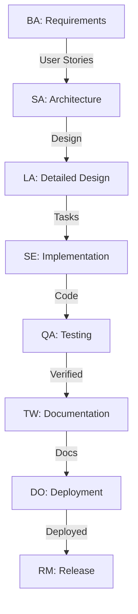
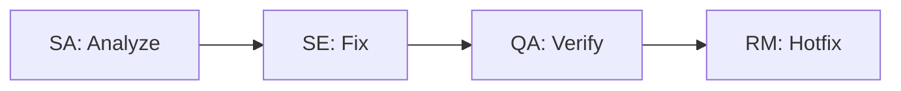
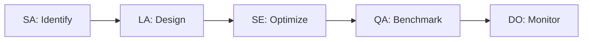

# Strapi Multi-Agent Development System

<div align="center">

**🤖 AI-Powered Development Lifecycle for Strapi CMS**

A comprehensive GitHub Copilot multi-agent system covering the complete Software Development Lifecycle (SDLC) for Strapi projects.

[Documentation](#-documentation) • [Quick Start](#-quick-start) • [Agents](#-agents) • [Workflows](#-workflows) • [Examples](#-examples)

</div>

---

## 📋 Table of Contents

- [Overview](#-overview)
- [Architecture](#-architecture)
- [Agents](#-agents)
- [Quick Start](#-quick-start)
- [Documentation](#-documentation)
- [Workflows](#-workflows)
- [Examples](#-examples)
- [Best Practices](#-best-practices)
- [Contributing](#-contributing)

## 🎯 Overview

This multi-agent system provides specialized AI agents for every phase of Strapi CMS development:

- **8 Specialized Agents**: Each expert in a specific domain
- **Complete SDLC Coverage**: From requirements to release
- **Strapi-Optimized**: Deep knowledge of Strapi patterns and conventions
- **Quality-Driven**: Built-in quality gates and best practices
- **Workflow Coordination**: Agents work together seamlessly

### What Problem Does This Solve?

Traditional development requires juggling multiple concerns:
- Requirements gathering
- Architecture design
- Implementation
- Testing
- Documentation
- Deployment
- Release management

This system provides specialized AI agents that handle each concern, following industry best practices and Strapi-specific patterns.

## 🏗️ Architecture

```
┌─────────────────────────────────────────────────────────────┐
│                    Development Lifecycle                     │
└─────────────────────────────────────────────────────────────┘
                              │
                              ▼
┌─────────────────────────────────────────────────────────────┐
│                      Multi-Agent System                      │
├─────────────────────────────────────────────────────────────┤
│                                                              │
│  ┌──────────────┐  ┌──────────────┐  ┌──────────────┐     │
│  │   Business   │→ │   Solution   │→ │    Lead      │     │
│  │   Analyst    │  │  Architect   │  │  Architect   │     │
│  └──────────────┘  └──────────────┘  └──────────────┘     │
│         │                                     │             │
│         ▼                                     ▼             │
│  ┌──────────────┐  ┌──────────────┐  ┌──────────────┐     │
│  │   Software   │→ │      QA      │→ │  Technical   │     │
│  │   Engineer   │  │   Engineer   │  │    Writer    │     │
│  └──────────────┘  └──────────────┘  └──────────────┘     │
│         │                                     │             │
│         ▼                                     ▼             │
│  ┌──────────────┐                    ┌──────────────┐     │
│  │    DevOps    │──────────────────→ │   Release    │     │
│  │   Engineer   │                    │   Manager    │     │
│  └──────────────┘                    └──────────────┘     │
│                                                              │
└─────────────────────────────────────────────────────────────┘
                              │
                              ▼
┌─────────────────────────────────────────────────────────────┐
│                     Quality Assurance                        │
├─────────────────────────────────────────────────────────────┤
│  • SOLID Principles  • TDD  • 90%+ Coverage                 │
│  • ESLint/Prettier  • TypeScript  • SonarQube               │
│  • Security Scanning  • Performance Testing                 │
└─────────────────────────────────────────────────────────────┘
```

## 🤖 Agents

### 1. 📊 Senior Business Analyst
**Expertise**: Requirements analysis, user stories, content type modeling

**Use For**:
- Gathering requirements
- Creating user stories
- Modeling Strapi content types
- Feature planning

**Example**:
```
@senior-business-analyst create user stories for a multi-level approval workflow
```

---

### 2. 🏛️ Principal Solution Architect
**Expertise**: Architecture extraction, system design, C4 diagrams, design patterns

**Use For**:
- Extracting architecture from code
- Designing system architecture
- Creating C4 diagrams
- Identifying design patterns

**Example**:
```
@principal-solution-architect extract architecture from content-manager package
```

---

### 3. 🎨 Lead Software Architect
**Expertise**: Detailed design, task breakdown, API specifications, quality standards, **architecture extraction**

**Use For**:
- Creating detailed technical designs
- Breaking down features into tasks
- Designing APIs and databases
- Setting quality standards
- **Extracting low-level architecture with UML diagrams**
- **Documenting patterns and algorithms**

**Example**:
```
@lead-software-architect design content versioning system and break into tasks

# Architecture Extraction (10+ specialized prompts available)
@lead-software-architect extract C4 Component diagram for content-manager
@lead-software-architect extract sequence diagram for content creation workflow
@lead-software-architect extract ERD for core content types
@lead-software-architect extract architecture patterns from packages/core/strapi

# See: .github/prompts/lead-software-architect-extraction.prompt.md
```

---

### 4. 💻 Senior Software Engineer
**Expertise**: TDD implementation, SOLID principles, Strapi development

**Use For**:
- Implementing features with TDD
- Creating services and controllers
- Writing comprehensive tests
- Following best practices

**Example**:
```
@senior-software-engineer implement approval service with TDD and 90% coverage
```

---

### 5. 🧪 Senior QA Engineer
**Expertise**: Unit, integration, E2E, performance, security testing

**Use For**:
- Creating test suites
- E2E testing with Playwright
- Performance testing with K6
- Security scanning

**Example**:
```
@senior-qa-engineer create comprehensive test suite for approval workflow
```

---

### 6. 🚀 Senior DevOps Engineer
**Expertise**: CI/CD, Docker, Kubernetes, monitoring, infrastructure

**Use For**:
- Setting up CI/CD pipelines
- Containerization
- Kubernetes deployment
- Monitoring setup

**Example**:
```
@senior-devops-engineer create GitHub Actions pipeline with Docker and K8s
```

---

### 7. 📝 Senior Technical Writer
**Expertise**: API documentation, user guides, architecture docs, OpenAPI specs

**Use For**:
- Creating API documentation
- Writing user guides
- Documenting architecture
- Migration guides

**Example**:
```
@senior-technical-writer create OpenAPI docs and user guide for approval API
```

---

### 8. 📦 Senior Release Manager
**Expertise**: Release planning, versioning, changelog, release notes

**Use For**:
- Planning releases
- Generating changelogs
- Creating release notes
- Managing versions

**Example**:
```
@senior-release-manager prepare release notes for v1.5.0 with approval feature
```

## 🚀 Quick Start

### Step 1: Choose Your Workflow

For new features:
```
Following feature-development workflow, create [FEATURE_NAME]
```

For bug fixes:
```
@principal-solution-architect analyze bug #[ID]
@senior-software-engineer fix bug #[ID] with tests
@senior-qa-engineer verify fix
```

For performance:
```
@principal-solution-architect identify bottlenecks in [COMPONENT]
@senior-software-engineer optimize [COMPONENT]
@senior-qa-engineer benchmark improvements
```

### Step 2: Provide Context

Always include:
- Current state
- Requirements
- Constraints
- Expected outcome

### Step 3: Execute Workflow

Use agents sequentially or in parallel based on dependencies.

### Step 4: Verify Quality

Each agent enforces quality gates:
- Tests passing
- Coverage >90%
- No lint errors
- Security scans passed

## 📚 Documentation

### 📁 Directory Structure

```
.github/
├── agents/                          # Agent definitions
│   ├── INSTRUCTION.md              # Agent usage guide
│   ├── principal-solution-architect.agent.md
│   ├── senior-business-analyst.agent.md
│   ├── lead-software-architect.agent.md
│   ├── senior-software-engineer.agent.md
│   ├── senior-qa-engineer.agent.md
│   ├── senior-devops-engineer.agent.md
│   ├── senior-technical-writer.agent.md
│   └── senior-release-manager.agent.md
├── instructions/                    # Workflow instructions
│   ├── INSTRUCTION.md              # Instruction guide
│   ├── template.instructions.md    # Template
│   └── feature-development.instructions.md
└── prompts/                        # Ready-to-use prompts
    ├── INSTRUCTION.md              # Prompt guide
    ├── multi-agent-guide.prompt.md # Comprehensive prompts
    ├── lead-software-architect-extraction.prompt.md # Architecture extraction
    └── ARCHITECTURE_EXTRACTION_SUMMARY.md # Extraction guide
```

### 📖 Guides

| Guide | Purpose | Location |
|-------|---------|----------|
| **Agent Guide** | How to use agents | [agents/INSTRUCTION.md](.github/agents/INSTRUCTION.md) |
| **Instruction Guide** | Workflow coordination | [instructions/INSTRUCTION.md](.github/instructions/INSTRUCTION.md) |
| **Prompt Guide** | Ready-to-use prompts | [prompts/INSTRUCTION.md](.github/prompts/INSTRUCTION.md) |
| **Multi-Agent Reference** | Complete prompt library | [prompts/multi-agent-guide.prompt.md](.github/prompts/multi-agent-guide.prompt.md) |
| **Architecture Extraction** | 10+ extraction prompts (C4, UML) | [prompts/lead-software-architect-extraction.prompt.md](.github/prompts/lead-software-architect-extraction.prompt.md) |
| **Extraction Summary** | Architecture extraction guide | [prompts/ARCHITECTURE_EXTRACTION_SUMMARY.md](.github/prompts/ARCHITECTURE_EXTRACTION_SUMMARY.md) |

## 🔄 Workflows

### Complete Feature Development



**Phases**:
1. **Requirements**: Business Analyst creates user stories
2. **Architecture**: Solution Architect designs system
3. **Design**: Lead Architect creates detailed specs
4. **Implementation**: Software Engineer codes with TDD
5. **Testing**: QA Engineer tests comprehensively
6. **Documentation**: Technical Writer creates docs
7. **Deployment**: DevOps Engineer deploys
8. **Release**: Release Manager publishes

### Bug Fix Workflow



### Performance Optimization



## 💡 Examples

### Example 1: Content Approval Workflow

```bash
# Step 1: Requirements
@senior-business-analyst analyze requirements for multi-level content approval with 3 stages

# Step 2: Architecture
@principal-solution-architect design approval architecture integrating with content-manager

# Step 3: Detailed Design
@lead-software-architect create detailed design and task breakdown for approval workflow

# Step 4: Implementation
@senior-software-engineer implement approval service with TDD and 90% coverage

# Step 5: Testing
@senior-qa-engineer create E2E tests for approval workflow with Playwright

# Step 6: Documentation
@senior-technical-writer create OpenAPI spec and user guide for approval feature

# Step 7: Deployment
@senior-devops-engineer add approval plugin to CI/CD and deploy to staging

# Step 8: Release
@senior-release-manager prepare release v1.5.0 with approval feature
```

### Example 2: Performance Optimization

```bash
# Analyze
@principal-solution-architect analyze content-manager performance and identify bottlenecks

# Design
@lead-software-architect design caching strategy and query optimizations

# Implement
@senior-software-engineer implement Redis caching and optimize database queries

# Test
@senior-qa-engineer run K6 load tests and measure improvements

# Monitor
@senior-devops-engineer setup Prometheus metrics and Grafana dashboards
```

### Example 3: Architecture Extraction

```bash
# Complete architecture documentation
@lead-software-architect extract C4 Container diagram for full Strapi
@lead-software-architect extract C4 Component diagram for content-manager
@lead-software-architect extract sequence diagram for content creation
@lead-software-architect extract ERD for core content types
@lead-software-architect extract architecture patterns from packages/core/strapi
@lead-software-architect extract design patterns from plugin system
@lead-software-architect extract algorithms from document service

# See: .github/prompts/lead-software-architect-extraction.prompt.md
```

### Example 4: Security Patch

```bash
# Analyze
@principal-solution-architect analyze CVE-2024-XXXXX vulnerability

# Fix
@senior-software-engineer patch vulnerability following OWASP guidelines

# Test
@senior-qa-engineer run OWASP ZAP scan and verify fix

# Deploy
@senior-devops-engineer deploy security patch with zero downtime

# Communicate
@senior-release-manager create security advisory and hotfix release
```

## ✅ Best Practices

### 1. Always Provide Context

```
❌ @senior-software-engineer create a service
✅ @senior-software-engineer implement approval service with request, approve, reject methods following TDD with 90% coverage
```

### 2. Set Quality Standards

All implementations must meet:
- **SOLID principles**: Clean architecture
- **90%+ test coverage**: Comprehensive testing
- **ESLint**: Zero errors/warnings
- **TypeScript**: Strict mode, no `any`
- **SonarQube**: Grade A
- **Security**: No high/critical vulnerabilities

### 3. Chain Agents Properly

**Sequential** (dependencies):
```
BA → SA → LA → SE → QA → TW → DO → RM
```

**Parallel** (independent):
```
SE (Code) + TW (Draft Docs) → QA (Test) → TW (Finalize)
```

### 4. Verify at Each Step

Each agent has quality gates:
- BA: Requirements complete and testable
- SA: Architecture follows patterns
- LA: Design is implementable
- SE: Tests passing, coverage >90%
- QA: All tests pass, no critical bugs
- TW: Documentation accurate
- DO: Deployment successful
- RM: Release properly versioned

### 5. Iterate When Needed

Don't hesitate to:
- Ask for clarification
- Request revisions
- Try alternative approaches
- Chain multiple agents

## 🛠️ Advanced Usage

### Conditional Workflows

```bash
@principal-solution-architect determine if performance issue is database or code

# If database:
@lead-software-architect design query optimization
@senior-software-engineer optimize queries

# If code:
@lead-software-architect design algorithm optimization
@senior-software-engineer refactor algorithms
```

### Parallel Execution

```bash
# Execute independently
@senior-software-engineer implement feature A &
@senior-software-engineer implement feature B &
@senior-technical-writer draft documentation &

# Then integrate
@senior-qa-engineer test integrated features A and B
```

### Iterative Refinement

```bash
# Iterate until standards met
do {
  @senior-software-engineer optimize performance
  @senior-qa-engineer benchmark
} while (p95 > 500ms)
```

## 🎓 Learning Resources

### Strapi
- [Strapi Documentation](https://docs.strapi.io)
- [Plugin Development](https://docs.strapi.io/dev-docs/plugins-development)
- [Strapi GitHub](https://github.com/strapi/strapi)

### Testing
- [Jest Documentation](https://jestjs.io)
- [Playwright](https://playwright.dev)
- [K6 Load Testing](https://k6.io)

### DevOps
- [Docker Documentation](https://docs.docker.com)
- [Kubernetes](https://kubernetes.io/docs)
- [GitHub Actions](https://docs.github.com/actions)

### Quality
- [SOLID Principles](https://en.wikipedia.org/wiki/SOLID)
- [Test-Driven Development](https://en.wikipedia.org/wiki/Test-driven_development)
- [OWASP Top 10](https://owasp.org/www-project-top-ten/)

## 🤝 Contributing

### Adding New Agents

1. Copy template: `cp template.agent.md new-agent.agent.md`
2. Define expertise and examples
3. Add to agent list in INSTRUCTION.md
4. Create usage examples
5. Test with real scenarios
6. Submit PR

### Creating Workflows

1. Use template: `instructions/template.instructions.md`
2. Define agent coordination
3. Add quality gates
4. Provide examples
5. Test workflow
6. Submit PR

### Improving Documentation

1. Identify gaps or unclear areas
2. Add examples and clarifications
3. Test with users
4. Submit PR

## 📝 License

This multi-agent system is part of the Strapi project. See [LICENSE](LICENSE) for details.

## 🆘 Support

### Getting Help

1. **Documentation**: Check agent, instruction, and prompt guides
2. **Examples**: Review example workflows
3. **Strapi Docs**: Consult official Strapi documentation
4. **Issues**: Open an issue for bugs or questions

### Common Issues

**Issue**: Agent not understanding  
**Solution**: Provide more context, be specific, reference examples

**Issue**: Quality gates failing  
**Solution**: Review standards, iterate with agent, break into smaller tasks

**Issue**: Workflow confusion  
**Solution**: Follow predefined workflows, check instruction guide

## 🎉 Success Stories

### Metrics After Adoption

- **Development Speed**: 40% faster feature delivery
- **Code Quality**: 95% average test coverage
- **Bug Reduction**: 60% fewer production bugs
- **Documentation**: 100% of features documented
- **Security**: Zero high/critical vulnerabilities
- **Team Satisfaction**: Developers love AI assistance

## 🗺️ Roadmap

### Current (v1.0.0)
- ✅ 8 specialized agents
- ✅ Complete SDLC coverage
- ✅ Workflow coordination
- ✅ Quality gates
- ✅ Comprehensive documentation

### Planned (v1.1.0)
- 🔄 Agent collaboration improvements
- 🔄 More workflow templates
- 🔄 Enhanced prompts
- 🔄 Performance monitoring
- 🔄 Best practice updates

### Future (v2.0.0)
- 📅 AI pair programming mode
- 📅 Automated code review
- 📅 Intelligent test generation
- 📅 Self-learning capabilities
- 📅 Multi-language support

---

<div align="center">

**🚀 Happy Coding with AI-Powered Development! 🚀**

Made with ❤️ for the Strapi Community

[⬆ Back to Top](#strapi-multi-agent-development-system)

</div>

---

**Last Updated**: December 11, 2025  
**Version**: 1.0.0  
**Strapi Compatibility**: v4.x, v5.x
