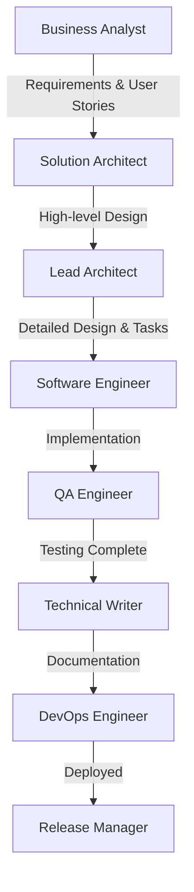
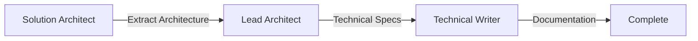
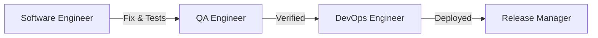
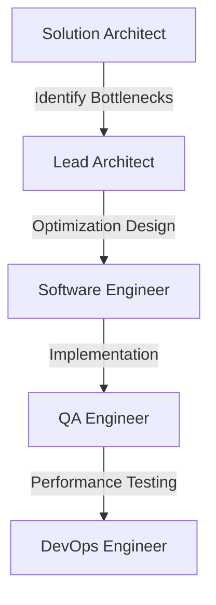

# GitHub Copilot Custom Agents - Instructions

## Overview

This directory contains specialized GitHub Copilot agents designed to support the complete Software Development Lifecycle (SDLC) for **Strapi CMS** projects. Each agent is an expert in a specific domain with deep knowledge of Strapi patterns, conventions, and best practices.

## Available Agents

### 1. Principal Solution Architect
**File**: `principal-solution-architect.agent.md`  
**Expertise**: Architecture extraction, system design, C4 diagrams, design patterns  
**Use When**: 
- Extracting architecture from existing codebase
- Creating architecture documentation
- Analyzing design patterns and architectural decisions
- Planning major system refactoring
- Designing distributed systems

**Example Usage**:
```
@principal-solution-architect extract the current architecture of the content-manager package and create a C4 context diagram
```

### 2. Senior Business Analyst
**File**: `senior-business-analyst.agent.md`  
**Expertise**: Requirements analysis, user stories, content type modeling, feature planning  
**Use When**:
- Gathering and analyzing requirements
- Creating user stories and acceptance criteria
- Modeling Strapi content types
- Planning new features
- Analyzing business processes

**Example Usage**:
```
@senior-business-analyst create user stories for a multi-step approval workflow feature with 3 approval levels
```

### 3. Lead Software Architect
**File**: `lead-software-architect.agent.md`  
**Expertise**: Detailed design, task breakdown, quality standards, technical specifications  
**Use When**:
- Creating detailed technical designs
- Breaking down features into implementable tasks
- Defining quality gates and standards
- Designing plugin architecture
- Planning database schemas

**Example Usage**:
```
@lead-software-architect design a content versioning system and break it down into development tasks
```

### 4. Senior Software Engineer
**File**: `senior-software-engineer.agent.md`  
**Expertise**: TDD implementation, SOLID principles, code quality, Strapi development  
**Use When**:
- Implementing Strapi plugins, services, controllers
- Writing tests (unit, integration)
- Following TDD methodology
- Implementing business logic
- Code refactoring

**Example Usage**:
```
@senior-software-engineer implement a content approval service with TDD approach including all tests
```

### 5. Senior QA Engineer
**File**: `senior-qa-engineer.agent.md`  
**Expertise**: Testing strategies, test automation, performance testing, security testing  
**Use When**:
- Creating comprehensive test suites
- Setting up E2E tests with Playwright
- Performance testing with K6/JMeter
- Security vulnerability testing
- Test coverage analysis

**Example Usage**:
```
@senior-qa-engineer create integration tests for the approval API endpoints with 90% coverage
```

### 6. Senior DevOps Engineer
**File**: `senior-devops-engineer.agent.md`  
**Expertise**: CI/CD, Docker, Kubernetes, monitoring, infrastructure  
**Use When**:
- Setting up CI/CD pipelines
- Containerizing Strapi applications
- Deploying to cloud platforms
- Setting up monitoring and logging
- Infrastructure as Code

**Example Usage**:
```
@senior-devops-engineer create a complete GitHub Actions CI/CD pipeline with Docker build and K8s deployment
```

### 7. Senior Technical Writer
**File**: `senior-technical-writer.agent.md`  
**Expertise**: API documentation, user guides, technical writing, OpenAPI specs  
**Use When**:
- Creating API documentation
- Writing user guides
- Documenting architecture
- Creating developer onboarding materials
- Writing release notes

**Example Usage**:
```
@senior-technical-writer create comprehensive API documentation for the approval endpoints in OpenAPI format
```

### 8. Senior Release Manager
**File**: `senior-release-manager.agent.md`  
**Expertise**: Release planning, versioning, changelog, release notes  
**Use When**:
- Planning releases
- Generating changelogs
- Creating release notes
- Managing semantic versioning
- Coordinating release communication

**Example Usage**:
```
@senior-release-manager prepare release notes for v1.5.0 including the new approval workflow feature
```

## Agent Collaboration Workflows

### Workflow 1: New Feature Development



**Step-by-Step**:
1. **@senior-business-analyst**: Gather requirements, create user stories
2. **@principal-solution-architect**: Design high-level architecture
3. **@lead-software-architect**: Create detailed design, break into tasks
4. **@senior-software-engineer**: Implement features with TDD
5. **@senior-qa-engineer**: Comprehensive testing (unit, integration, E2E, performance)
6. **@senior-technical-writer**: Create documentation (API docs, user guides)
7. **@senior-devops-engineer**: Setup CI/CD, deploy to environments
8. **@senior-release-manager**: Prepare release notes, manage versioning

### Workflow 2: Architecture Analysis & Documentation



**Step-by-Step**:
1. **@principal-solution-architect**: Extract current architecture, create C4 diagrams
2. **@lead-software-architect**: Document design patterns, technical decisions
3. **@senior-technical-writer**: Create comprehensive architecture documentation

### Workflow 3: Bug Fix & Hotfix



**Step-by-Step**:
1. **@senior-software-engineer**: Implement fix with tests
2. **@senior-qa-engineer**: Verify fix, run regression tests
3. **@senior-devops-engineer**: Deploy to production
4. **@senior-release-manager**: Create hotfix release notes

### Workflow 4: Performance Optimization



**Step-by-Step**:
1. **@principal-solution-architect**: Analyze architecture for performance issues
2. **@lead-software-architect**: Design optimization strategy
3. **@senior-software-engineer**: Implement optimizations
4. **@senior-qa-engineer**: Run performance tests (K6, JMeter)
5. **@senior-devops-engineer**: Monitor production performance

## Best Practices

### 1. Agent Selection
- **Choose the right agent** for the task based on expertise
- **Chain agents** for complex workflows (e.g., BA → Architect → Engineer → QA)
- **Use multiple agents** in parallel when tasks are independent

### 2. Context Provision
- **Provide clear context** about the Strapi project
- **Reference existing code** when relevant
- **Specify constraints** (time, resources, technologies)
- **Include acceptance criteria** for validation

### 3. Quality Standards
All agents enforce:
- **SOLID principles**: Single Responsibility, Open/Closed, Liskov Substitution, Interface Segregation, Dependency Inversion
- **KISS**: Keep It Simple, Stupid
- **DRY**: Don't Repeat Yourself
- **TDD**: Test-Driven Development
- **90%+ test coverage**: Comprehensive testing
- **Code quality**: ESLint, Prettier, TypeScript
- **Security**: Snyk scans, OWASP compliance
- **SonarQube**: Grade A quality

### 4. Strapi Conventions
All agents follow:
- **Naming conventions**: Strapi's standard naming patterns
- **File structure**: Proper organization of plugins, services, controllers
- **Koa patterns**: Middleware, context handling
- **Database patterns**: Using Strapi ORM correctly
- **Plugin architecture**: Proper plugin development
- **TypeScript**: Strong typing, no `any`

### 5. Communication
- **Be specific** in your requests
- **Provide examples** when possible
- **Ask for clarification** if output doesn't meet needs
- **Request iterations** to refine results
- **Combine agents** for comprehensive solutions

## Examples by Scenario

### Scenario 1: Build New Plugin

```bash
# Step 1: Requirements
@senior-business-analyst analyze requirements for a content scheduling plugin that allows users to schedule publish/unpublish dates

# Step 2: Architecture
@principal-solution-architect design the high-level architecture for the content scheduling plugin

# Step 3: Detailed Design
@lead-software-architect create detailed technical design and break down into development tasks

# Step 4: Implementation
@senior-software-engineer implement the scheduling service with TDD approach

# Step 5: Testing
@senior-qa-engineer create comprehensive test suite for the scheduling plugin

# Step 6: Documentation
@senior-technical-writer create user guide and API documentation for content scheduling

# Step 7: Deployment
@senior-devops-engineer add the new plugin to CI/CD pipeline

# Step 8: Release
@senior-release-manager prepare release notes for the scheduling feature
```

### Scenario 2: Optimize Performance

```bash
# Step 1: Analysis
@principal-solution-architect analyze the current architecture and identify performance bottlenecks in the content-manager

# Step 2: Design Optimization
@lead-software-architect design a caching strategy and database query optimization plan

# Step 3: Implement
@senior-software-engineer implement the caching layer and optimize database queries

# Step 4: Test Performance
@senior-qa-engineer create K6 load tests and verify performance improvements

# Step 5: Monitor
@senior-devops-engineer setup Prometheus metrics and Grafana dashboards for monitoring
```

### Scenario 3: Fix Security Vulnerability

```bash
# Step 1: Analysis
@principal-solution-architect analyze the security vulnerability CVE-2024-XXXXX in our authentication system

# Step 2: Design Fix
@lead-software-architect design a secure solution following OWASP guidelines

# Step 3: Implement
@senior-software-engineer implement the security fix with comprehensive tests

# Step 4: Security Testing
@senior-qa-engineer run security tests and verify the vulnerability is patched

# Step 5: Deploy
@senior-devops-engineer create hotfix deployment plan and execute

# Step 6: Communication
@senior-release-manager create security advisory and hotfix release notes
```

### Scenario 4: Refactor Legacy Code

```bash
# Step 1: Understand Current State
@principal-solution-architect extract the current design patterns and architecture from the legacy upload plugin

# Step 2: Design Modern Approach
@lead-software-architect design a refactored architecture using modern Strapi v4 patterns

# Step 3: Break Down Work
@lead-software-architect create a phased refactoring plan with minimal disruption

# Step 4: Implement Incrementally
@senior-software-engineer refactor module by module with comprehensive tests

# Step 5: Regression Testing
@senior-qa-engineer ensure all existing functionality still works

# Step 6: Document Changes
@senior-technical-writer update documentation to reflect new architecture
```

## Agent Coordination Tips

### Sequential vs Parallel

**Use Sequential** when:
- Output of one agent is input for another
- Design must be complete before implementation
- Testing depends on implementation completion

**Use Parallel** when:
- Tasks are independent
- Documentation can be drafted while coding
- Multiple test types can run simultaneously

### Handoff Points

Clear handoff between agents:
- **BA → Architect**: User stories & acceptance criteria
- **Architect → Engineer**: Technical design & task breakdown
- **Engineer → QA**: Implemented code & unit tests
- **QA → DevOps**: Tested code & deployment requirements
- **DevOps → Release Manager**: Deployed version & change log

### Quality Gates

Each agent verifies:
- **Business Analyst**: Requirements are complete, clear, testable
- **Architect**: Design follows SOLID, patterns are documented
- **Engineer**: Code passes tests, follows conventions, 90%+ coverage
- **QA**: All tests pass, no critical bugs, performance acceptable
- **DevOps**: Deployment successful, monitoring active, rollback tested
- **Technical Writer**: Documentation accurate, complete, accessible
- **Release Manager**: Version correct, changelog complete, communication ready

## Troubleshooting

### Agent Not Understanding Context
- Provide more specific details
- Reference exact file paths
- Include code snippets
- Mention Strapi version

### Output Quality Issues
- Request revisions with specific feedback
- Ask for alternative approaches
- Provide examples of expected output
- Chain multiple agents for comprehensive solution

### Agent Selection Confusion
- Refer to the "Use When" sections above
- Consider using multiple agents in sequence
- Ask the agent if they're the right fit for the task

## Maintenance

### Updating Agents
- Agents are markdown files in `.github/agents/`
- Update expertise sections as Strapi evolves
- Add new examples based on common patterns
- Keep code samples up-to-date with latest Strapi version

### Adding New Agents
1. Create new `.agent.md` file
2. Follow the template structure
3. Include Strapi-specific expertise
4. Add examples and checklists
5. Update this INSTRUCTION.md with agent description

### Version Compatibility
- Agents are designed for **Strapi v4.x and v5.x**
- Update examples when major Strapi versions release
- Mark deprecated patterns clearly
- Provide migration guidance

## Resources

- **Strapi Documentation**: https://docs.strapi.io
- **GitHub Copilot Agents**: https://docs.github.com/copilot/customizing-copilot/creating-custom-agents
- **Agent Templates**: `.github/agents/template.agent.md`
- **Project Conventions**: `.github/CONTRIBUTING.md`

## Support

For questions or issues with agents:
1. Review this instruction file
2. Check agent-specific documentation
3. Consult Strapi documentation
4. Open an issue in the repository

---

**Last Updated**: December 11, 2025  
**Strapi Version Compatibility**: v4.x, v5.x  
**Agent Version**: 1.0.0
