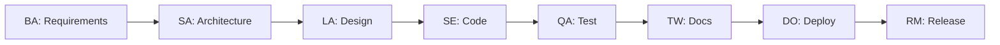
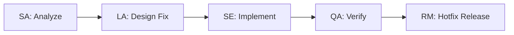
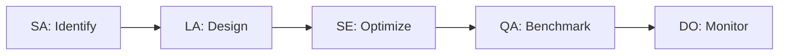
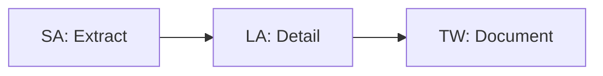

# GitHub Copilot Instructions - Strapi Multi-Agent System

## Overview

This directory contains custom instructions that coordinate specialized GitHub Copilot agents for comprehensive Strapi CMS development. Each instruction defines workflows that chain multiple agents together to accomplish complex development tasks.

## 📁 Directory Structure

```
.github/
├── agents/                          # Specialized agent definitions
│   ├── INSTRUCTION.md              # How to use agents
│   ├── principal-solution-architect.agent.md
│   ├── senior-business-analyst.agent.md
│   ├── lead-software-architect.agent.md
│   ├── senior-software-engineer.agent.md
│   ├── senior-qa-engineer.agent.md
│   ├── senior-devops-engineer.agent.md
│   ├── senior-technical-writer.agent.md
│   └── senior-release-manager.agent.md
├── instructions/                    # Workflow instructions
│   ├── template.instructions.md    # Template for new instructions
│   └── feature-development.instructions.md
└── prompts/                        # Ready-to-use prompts
    └── multi-agent-guide.prompt.md

```

## 🎯 Quick Start

### Using Pre-defined Workflows

Reference an instruction in your GitHub Copilot request:

```
Following the feature-development workflow, help me build a content scheduling feature
```

### Using Individual Agents

Call specific agents directly:

```
@senior-business-analyst create user stories for a notification system

@senior-software-engineer implement the notification service with TDD

@senior-qa-engineer create E2E tests for the notification workflow
```

### Chaining Multiple Agents

Execute a multi-step workflow:

```bash
# Requirements
@senior-business-analyst analyze requirements for real-time collaboration

# Architecture  
@principal-solution-architect design architecture for the collaboration feature

# Implementation
@senior-software-engineer implement the collaboration service with WebSocket

# Testing
@senior-qa-engineer create performance tests for 100 concurrent users
```

## 📋 Available Instructions

### 1. Feature Development Workflow
**File**: `feature-development.instructions.md`  
**Purpose**: Complete feature development from requirements to deployment

**Phases**:
1. Requirements Analysis (Business Analyst)
2. Architecture Design (Solution Architect)
3. Detailed Design (Lead Architect)
4. Implementation (Software Engineer)
5. Testing (QA Engineer)
6. Documentation (Technical Writer)
7. Deployment (DevOps Engineer)
8. Release (Release Manager)

**Use When**: Building new features for Strapi

**Example**:
```
Following feature-development workflow, create a multi-level approval system
```

### 2. Template Instruction
**File**: `template.instructions.md`  
**Purpose**: Guide for creating custom instructions

**Contains**:
- Instruction structure
- Common patterns (feature dev, bug fix, performance, architecture docs, security)
- Best practices
- Examples

**Use When**: Creating new workflow instructions

## 🚀 Common Workflows

### New Feature Development



**Prompt**:
```
Following feature-development workflow:

@senior-business-analyst analyze requirements for content versioning

@principal-solution-architect design the versioning architecture

@lead-software-architect create detailed design and task breakdown

@senior-software-engineer implement version control service with TDD

@senior-qa-engineer create comprehensive test suite

@senior-technical-writer create API docs and user guide

@senior-devops-engineer deploy to staging with monitoring

@senior-release-manager prepare release notes for v1.7.0
```

### Bug Fix Workflow



**Prompt**:
```
@principal-solution-architect analyze the pagination bug #456 and identify root cause

@lead-software-architect design a fix for the pagination issue

@senior-software-engineer implement the fix with regression tests

@senior-qa-engineer verify the fix and run full regression suite

@senior-release-manager prepare hotfix release v1.5.1
```

### Performance Optimization



**Prompt**:
```
@principal-solution-architect analyze performance bottlenecks in content-manager

@lead-software-architect design caching and query optimization strategy

@senior-software-engineer implement optimizations with benchmarks

@senior-qa-engineer run K6 load tests and compare metrics

@senior-devops-engineer setup Prometheus metrics for monitoring
```

### Architecture Documentation



**Prompt**:
```
@principal-solution-architect extract architecture from packages/core/admin

@lead-software-architect document design patterns and technical decisions

@senior-technical-writer create comprehensive architecture documentation
```

## 🎨 Creating Custom Instructions

### Step 1: Use the Template

Copy `template.instructions.md` and customize:

```bash
cp template.instructions.md my-workflow.instructions.md
```

### Step 2: Define the Workflow

```markdown
---
description: Your workflow description
applyTo: '**/*.ts'  # File pattern
---

# Workflow Name

## Context
When to use this workflow

## Agents Required
List agents and responsibilities

## Workflow Steps
Step-by-step process

## Quality Standards
Gates and criteria

## Examples
Real usage examples
```

### Step 3: Test the Instruction

Reference it in a GitHub Copilot request:

```
Following my-workflow, help me with [task]
```

## 📚 Instruction Patterns

### Pattern 1: Sequential Workflow
Agents execute in order, each depending on previous output.

**Example**: Feature Development
```
BA → SA → LA → SE → QA → TW → DO → RM
```

### Pattern 2: Parallel Workflow
Independent tasks executed simultaneously.

**Example**: Feature + Documentation
```
SE (Implementation) + TW (Draft Docs) → QA (Test) → TW (Finalize Docs)
```

### Pattern 3: Iterative Workflow
Agents iterate until quality standards met.

**Example**: Optimization
```
SA (Analyze) → SE (Optimize) → QA (Benchmark) → [Repeat if not meeting target]
```

### Pattern 4: Conditional Workflow
Path depends on outcome.

**Example**: Security Fix
```
SA (Analyze) → [Critical?] → SE (Hotfix) : SE (Normal Fix)
```

## 🎯 Best Practices

### 1. Clear Context
Always provide:
- Current state
- Requirements
- Constraints
- Expected output

### 2. Quality Gates
Define acceptance criteria between steps:
```markdown
### Quality Gate
- [ ] Tests passing
- [ ] Coverage >90%
- [ ] No ESLint errors
- [ ] Documentation complete
```

### 3. Deliverables
Specify what each agent should produce:
```markdown
**Deliverables**:
- User stories document
- Acceptance criteria
- Content type models
```

### 4. Reference Previous Work
Link agent outputs:
```
Based on the architecture from @principal-solution-architect,
@senior-software-engineer implement...
```

### 5. Set Standards
Define quality expectations:
```
All implementations must:
- Follow SOLID principles
- Achieve 90%+ test coverage
- Pass ESLint with 0 errors
- Use TypeScript strict mode
```

## 📖 Documentation

### For Agents
See: `../agents/INSTRUCTION.md`

### For Prompts
See: `../prompts/multi-agent-guide.prompt.md`

### For Strapi Development
See: Project memories in `.serena/memories/`

## 🔄 Workflow Examples

### Example 1: E-commerce Feature

```bash
# Complete workflow for product catalog with variants

# Requirements
@senior-business-analyst analyze requirements for product catalog with variants, pricing, inventory

# Architecture
@principal-solution-architect design product catalog architecture with variant management and inventory tracking

# Detailed Design
@lead-software-architect create database schema for products, variants, and inventory with API design

# Implementation
@senior-software-engineer implement product service with variant and inventory management using TDD

# Testing
@senior-qa-engineer create integration tests for product CRUD and inventory updates

# Documentation
@senior-technical-writer create API documentation and user guide for product management

# Deployment
@senior-devops-engineer setup CI/CD for product catalog module

# Release
@senior-release-manager prepare release notes for v2.0.0 with new product catalog
```

### Example 2: Security Enhancement

```bash
# Security audit and enhancement workflow

# Audit
@principal-solution-architect perform security architecture review focusing on authentication and data protection

# Design Fix
@lead-software-architect design enhanced security measures following OWASP guidelines

# Implement
@senior-software-engineer implement security enhancements with comprehensive tests

# Security Test
@senior-qa-engineer run OWASP ZAP scan and penetration testing

# Document
@senior-technical-writer create security documentation and best practices guide

# Deploy
@senior-devops-engineer deploy security updates with zero downtime

# Communicate
@senior-release-manager create security advisory and update documentation
```

### Example 3: Migration Project

```bash
# Strapi v4 to v5 migration workflow

# Analyze
@principal-solution-architect analyze current v4 architecture and v5 compatibility

# Plan
@lead-software-architect create migration plan with breaking changes and update strategy

# Implement
@senior-software-engineer migrate code following v5 patterns with backward compatibility tests

# Test
@senior-qa-engineer create migration verification tests and regression suite

# Document
@senior-technical-writer create migration guide with before/after examples

# Deploy
@senior-devops-engineer create blue-green deployment strategy for zero-downtime migration

# Release
@senior-release-manager prepare v5 migration release notes with upgrade instructions
```

## 🛠️ Troubleshooting

### Issue: Instruction not working
**Solution**: 
- Check YAML frontmatter syntax
- Verify `applyTo` pattern matches your files
- Ensure instruction is in `.github/instructions/`

### Issue: Agent not understanding context
**Solution**:
- Provide more specific details
- Reference exact file paths
- Include code snippets
- Mention Strapi version

### Issue: Quality gates failing
**Solution**:
- Review quality criteria
- Iterate with agent
- Break down into smaller tasks
- Request alternative approaches

### Issue: Multiple agents conflicting
**Solution**:
- Define clear handoff points
- Specify deliverables explicitly
- Use sequential execution for dependencies
- Document assumptions

## 📊 Metrics & Success Criteria

### Workflow Efficiency
- Time from requirements to deployment
- Number of iterations needed
- Quality gate pass rate

### Code Quality
- Test coverage >90%
- ESLint errors: 0
- SonarQube grade: A
- Snyk vulnerabilities: 0 high/critical

### Documentation Quality
- API docs completeness
- User guide clarity
- Architecture diagram accuracy
- Migration guide effectiveness

## 🔐 Security Considerations

All workflows enforce:
- OWASP Top 10 compliance
- Security scanning (Snyk, OWASP ZAP)
- Secrets management (no hardcoded secrets)
- Input validation
- Authentication/authorization

## 🚀 Advanced Usage

### Parallel Agent Execution

```bash
# Execute independent tasks in parallel

# Start parallel tracks
@senior-software-engineer implement feature A &
@senior-software-engineer implement feature B &
@senior-technical-writer draft documentation &

# Wait for completion, then test
@senior-qa-engineer test features A and B with integrated tests
```

### Conditional Workflows

```bash
# Choose path based on analysis

@principal-solution-architect analyze performance issue

# If database bottleneck:
@lead-software-architect design query optimization and caching strategy
@senior-software-engineer optimize database queries

# If code bottleneck:
@lead-software-architect design algorithm optimization
@senior-software-engineer refactor algorithms
```

### Iterative Refinement

```bash
# Iterate until quality standards met

do {
  @senior-software-engineer optimize query performance
  @senior-qa-engineer run performance benchmark
} while (p95 > 500ms)

@senior-release-manager document performance improvements
```

## 📝 Contributing

### Adding New Instructions

1. Copy template: `cp template.instructions.md new-workflow.instructions.md`
2. Define workflow steps
3. Add examples
4. Test with real scenarios
5. Document in this README
6. Submit PR

### Improving Existing Instructions

1. Test instruction with various scenarios
2. Document issues or improvements
3. Update instruction file
4. Add examples
5. Submit PR

## 📞 Support

For questions or issues:
1. Review this documentation
2. Check `../agents/INSTRUCTION.md`
3. Consult `../prompts/multi-agent-guide.prompt.md`
4. Check Strapi documentation
5. Open an issue in the repository

---

**Last Updated**: December 11, 2025  
**Instruction System Version**: 1.0.0  
**Strapi Compatibility**: v4.x, v5.x
