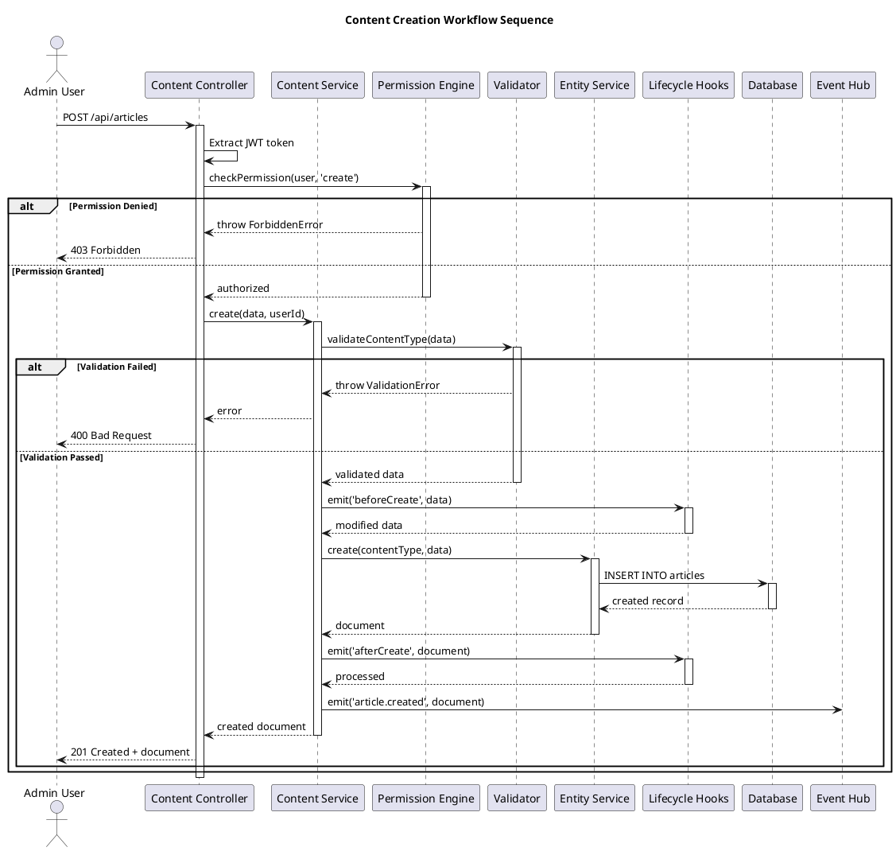
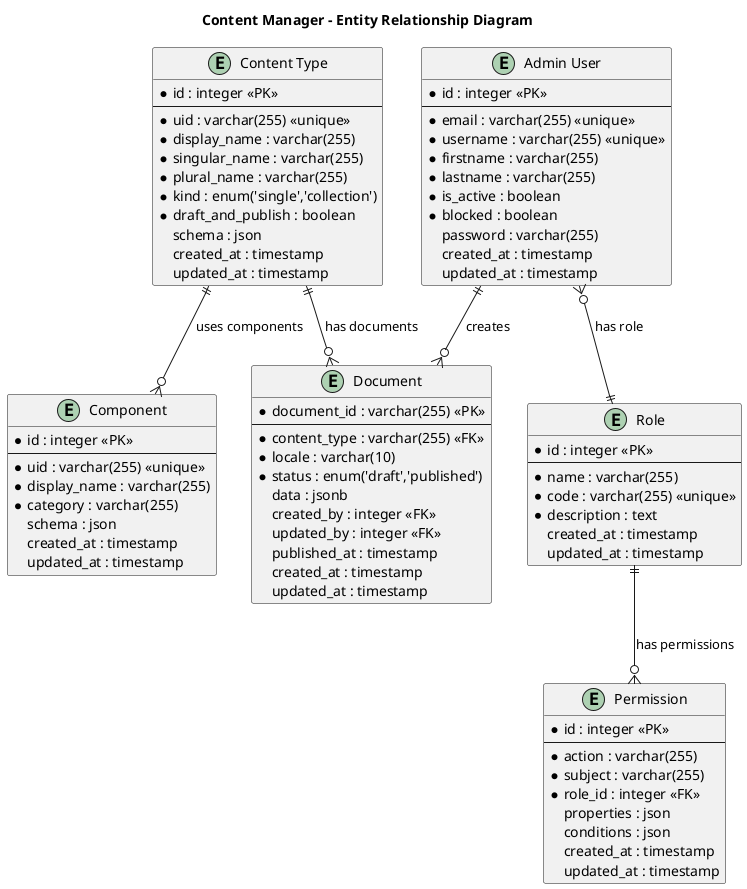
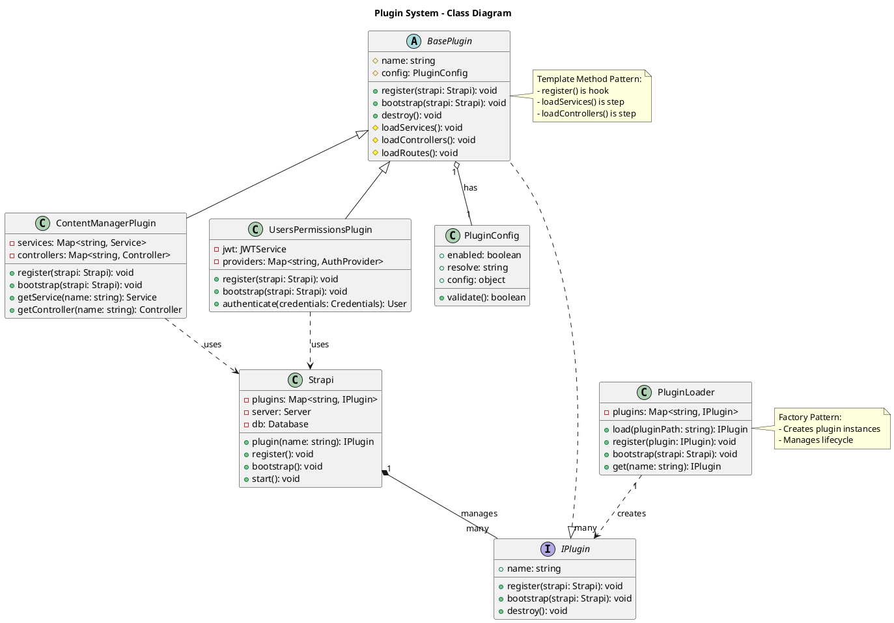
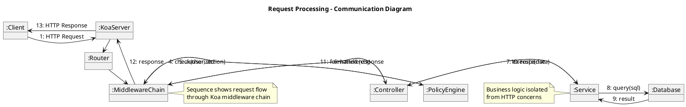
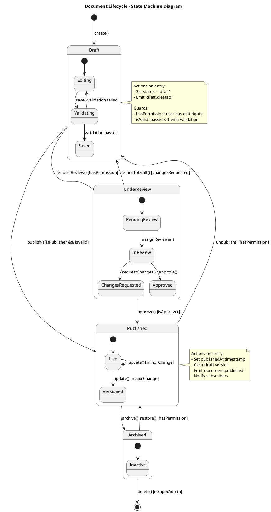

# Lead Software Architect - Architecture Extraction Prompts

## 🎯 Purpose

Comprehensive prompts for extracting low-level architecture design, patterns, and algorithms from Strapi codebase with detailed UML diagrams in PlantUML format.

---

## 📊 Prompt 1: C4 Component Diagram Extraction

### Prompt Template

```
@lead-software-architect analyze [PACKAGE_NAME] and extract the C4 Component diagram showing:

1. **Components**: All major components/modules in the package
2. **Dependencies**: Internal and external dependencies
3. **Interactions**: How components communicate
4. **Responsibilities**: What each component does

Generate the diagram in PlantUML format following C4 model conventions.

Package to analyze: [packages/core/strapi | packages/core/admin | packages/plugins/users-permissions]

Focus on:
- Component boundaries and interfaces
- Technology choices per component
- Data flow between components
- API endpoints exposed
```

### Example Usage

```
@lead-software-architect analyze packages/core/content-manager and extract the C4 Component diagram showing all major components, their dependencies, interactions, and responsibilities in PlantUML format
```

### Expected Output Structure

```plantuml
@startuml C4_Component
!include https://raw.githubusercontent.com/plantuml-stdlib/C4-PlantUML/master/C4_Component.puml

title Component Diagram - Content Manager

Container_Boundary(content_manager, "Content Manager Plugin") {
  Component(controller, "Controller Layer", "Koa Controller", "Handles HTTP requests for content management")
  Component(service, "Service Layer", "Business Logic", "CRUD operations, validation, permissions")
  Component(entity_service, "Entity Service", "Strapi Core", "Low-level document operations")
  Component(permission_engine, "Permission Engine", "RBAC", "Content type permissions")
  Component(lifecycle_hooks, "Lifecycle Hooks", "Event System", "Before/after hooks")
  
  ComponentDb(document_store, "Document Store", "Database", "Content documents")
}

Rel(controller, service, "Uses", "REST API")
Rel(service, entity_service, "Calls", "Document Service API")
Rel(service, permission_engine, "Checks", "Permissions")
Rel(service, lifecycle_hooks, "Emits", "Events")
Rel(entity_service, document_store, "Reads/Writes", "SQL/NoSQL")

@enduml
```

---

## 📊 Prompt 2: C4 Container Diagram Extraction

### Prompt Template

```
@lead-software-architect extract the C4 Container diagram for Strapi showing:

1. **Containers**: All deployable units (Admin, API, Database, Plugins)
2. **Technologies**: Tech stack for each container
3. **Interactions**: Inter-container communication protocols
4. **External Systems**: Third-party integrations

Scope: [Full Strapi application | Specific plugin ecosystem | Core system]

Generate in PlantUML C4 Container format.
```

### Example Usage

```
@lead-software-architect extract the C4 Container diagram for the full Strapi application showing all containers, technologies, interactions, and external systems in PlantUML format
```

### Expected Output Structure

```plantuml
@startuml C4_Container
!include https://raw.githubusercontent.com/plantuml-stdlib/C4-PlantUML/master/C4_Container.puml

title Container Diagram - Strapi CMS

Person(admin, "Admin User", "Content creator/manager")
Person(api_user, "API Consumer", "Frontend application")

System_Boundary(strapi, "Strapi CMS") {
  Container(admin_panel, "Admin Panel", "React 18, Redux", "Web UI for content management")
  Container(api_server, "API Server", "Node.js, Koa.js", "REST/GraphQL API")
  Container(plugin_system, "Plugin System", "TypeScript", "Extensibility layer")
  ContainerDb(database, "Database", "PostgreSQL/MySQL/SQLite", "Content storage")
  Container(media_library, "Media Library", "Upload Plugin", "File storage")
}

System_Ext(s3, "AWS S3", "Cloud storage")
System_Ext(email_provider, "Email Service", "SMTP/SendGrid")
System_Ext(auth_provider, "Auth Provider", "OAuth/SAML")

Rel(admin, admin_panel, "Uses", "HTTPS")
Rel(api_user, api_server, "Calls", "REST/GraphQL")
Rel(admin_panel, api_server, "Calls", "REST API")
Rel(api_server, plugin_system, "Loads", "Plugin API")
Rel(api_server, database, "Reads/Writes", "ORM")
Rel(media_library, s3, "Uploads", "S3 SDK")
Rel(api_server, email_provider, "Sends", "SMTP")
Rel(api_server, auth_provider, "Authenticates", "OAuth 2.0")

@enduml
```

---

## 🔄 Prompt 3: Sequence Diagram Extraction

### Prompt Template

```
@lead-software-architect extract the sequence diagram for [WORKFLOW_NAME] showing:

1. **Actors**: Users, systems, components involved
2. **Flow**: Step-by-step interaction sequence
3. **Timing**: Synchronous vs asynchronous calls
4. **Error Paths**: Exception handling flows

Workflow: [Content creation | User authentication | Plugin installation | Document publication]

Generate in PlantUML sequence diagram format with detailed annotations.
```

### Example Usage

```
@lead-software-architect extract the sequence diagram for content creation workflow showing all actors, the complete flow from HTTP request to database persistence, timing, and error handling in PlantUML format
```

### Expected Output Structure



---

## 🗄️ Prompt 4: ERD (Entity Relationship Diagram) Extraction

### Prompt Template

```
@lead-software-architect extract the ERD diagram for [DOMAIN_NAME] showing:

1. **Entities**: Content types, tables, collections
2. **Attributes**: Fields with data types
3. **Relationships**: One-to-one, one-to-many, many-to-many
4. **Constraints**: Primary keys, foreign keys, unique constraints

Domain: [Core content types | Plugin data model | User management | Media library]

Generate in PlantUML ERD format with cardinality notation.
```

### Example Usage

```
@lead-software-architect extract the ERD diagram for the content-manager plugin showing all entities, attributes, relationships, and constraints in PlantUML format
```

### Expected Output Structure



---

## 🏗️ Prompt 5: Class Diagram Extraction

### Prompt Template

```
@lead-software-architect extract the class diagram for [MODULE_NAME] showing:

1. **Classes**: All classes, interfaces, types
2. **Properties**: Attributes with visibility and types
3. **Methods**: Operations with signatures
4. **Relationships**: Inheritance, composition, aggregation, dependency
5. **Design Patterns**: Applied patterns

Module: [Server bootstrap | Plugin system | Document service | Permission engine]

Generate in PlantUML class diagram format with stereotype annotations.
```

### Example Usage

```
@lead-software-architect extract the class diagram for the Strapi Plugin System showing all classes, properties, methods, relationships, and design patterns in PlantUML format
```

### Expected Output Structure



---

## 💬 Prompt 6: Communication Diagram Extraction

### Prompt Template

```
@lead-software-architect extract the communication diagram for [INTERACTION_SCENARIO] showing:

1. **Objects**: Instances involved in the interaction
2. **Messages**: Communication between objects with sequence numbers
3. **Data Flow**: What data is passed
4. **Collaboration**: How objects work together

Scenario: [Plugin loading | Request processing | Event propagation | File upload]

Generate in PlantUML communication diagram format.
```

### Example Usage

```
@lead-software-architect extract the communication diagram for the request processing scenario showing all objects, messages with sequence numbers, data flow, and collaboration in PlantUML format
```

### Expected Output Structure



---

## 🔄 Prompt 7: State Machine Diagram Extraction

### Prompt Template

```
@lead-software-architect extract the state machine diagram for [ENTITY_LIFECYCLE] showing:

1. **States**: All possible states of the entity
2. **Transitions**: Events that trigger state changes
3. **Guards**: Conditions for transitions
4. **Actions**: Activities performed during transitions

Entity: [Document lifecycle | User session | Plugin lifecycle | Upload status]

Generate in PlantUML state diagram format with guards and actions.
```

### Example Usage

```
@lead-software-architect extract the state machine diagram for document lifecycle showing all states, transitions, guards, and actions in PlantUML format
```

### Expected Output Structure



---

## 🎨 Prompt 8: Architecture Patterns Extraction

### Prompt Template

```
@lead-software-architect analyze [PACKAGE_NAME] and extract all architecture patterns implemented:

1. **Pattern Name**: Identify the pattern
2. **Implementation Location**: Files and modules
3. **Purpose**: Why this pattern is used
4. **Structure**: How it's implemented
5. **Example Code**: Real code snippets
6. **Benefits**: Advantages gained
7. **Trade-offs**: Costs or limitations

Patterns to identify:
- Layered Architecture
- Plugin Architecture
- Event-Driven Architecture
- Repository Pattern
- Service Layer Pattern
- Factory Pattern
- Strategy Pattern
- Observer Pattern
- Dependency Injection
- CQRS (Command Query Responsibility Segregation)

Package: [packages/core/strapi | packages/core/admin | full codebase]

Provide detailed documentation with code examples.
```

### Example Usage

```
@lead-software-architect analyze packages/core/strapi and extract all architecture patterns including their implementation location, purpose, structure, code examples, benefits, and trade-offs
```

---

## 🧩 Prompt 9: Design Patterns Extraction

### Prompt Template

```
@lead-software-architect analyze [MODULE_NAME] and extract all design patterns (GoF and beyond):

1. **Pattern Category**: Creational, Structural, Behavioral
2. **Pattern Name**: Specific pattern (e.g., Factory, Singleton)
3. **Intent**: Problem it solves
4. **Participants**: Classes/interfaces involved
5. **Code Example**: Real implementation from codebase
6. **UML Diagram**: PlantUML class diagram
7. **Consequences**: Benefits and liabilities

Patterns to identify:
- Creational: Factory, Builder, Singleton, Prototype
- Structural: Adapter, Decorator, Facade, Proxy, Composite
- Behavioral: Strategy, Observer, Command, Template Method, Chain of Responsibility

Module: [Server core | Plugin system | Document service | Admin panel]
```

### Example Usage

```
@lead-software-architect analyze the Strapi plugin system and extract all design patterns with their category, intent, participants, code examples, UML diagrams, and consequences
```

---

## ⚙️ Prompt 10: Algorithm Extraction

### Prompt Template

```
@lead-software-architect analyze [COMPONENT_NAME] and extract all core algorithms:

1. **Algorithm Name**: Descriptive name
2. **Purpose**: What problem it solves
3. **Location**: File and function
4. **Input/Output**: Parameters and return values
5. **Complexity**: Time and space complexity
6. **Pseudocode**: High-level algorithm steps
7. **Implementation**: Actual code
8. **Optimizations**: Performance improvements applied
9. **Edge Cases**: Handling of special cases

Focus areas:
- Query building and optimization
- Permission checking
- Content type validation
- Document transformation
- Search and filtering
- Sorting and pagination
- Relation population
- File upload processing

Component: [Document Service | Permission Engine | Query Builder | Upload Service]
```

### Example Usage

```
@lead-software-architect analyze the Strapi Document Service and extract all core algorithms with their purpose, complexity, pseudocode, implementation, optimizations, and edge case handling
```

---

## 📝 Usage Guidelines

### Best Practices

1. **Be Specific**: Name the exact package/module to analyze
2. **Set Scope**: Define boundaries (single file vs full package)
3. **Choose Format**: Request PlantUML for diagrams
4. **Request Details**: Ask for code examples and explanations
5. **Iterate**: Start high-level, then drill down

### Common Combinations

**Complete Architecture Extraction**:
```
1. @lead-software-architect extract C4 Container diagram for full Strapi
2. @lead-software-architect extract C4 Component diagram for content-manager
3. @lead-software-architect extract sequence diagram for content creation
4. @lead-software-architect extract ERD for core content types
5. @lead-software-architect extract architecture patterns from packages/core/strapi
6. @lead-software-architect extract design patterns from plugin system
7. @lead-software-architect extract algorithms from document service
```

**Plugin Analysis**:
```
@lead-software-architect analyze users-permissions plugin:
- C4 Component diagram
- Class diagram
- State machine for user lifecycle
- All design patterns
- Authentication algorithm
```

**Deep Dive on Feature**:
```
@lead-software-architect analyze content versioning:
- Sequence diagram for version creation
- ERD for version tables
- State machine for version states
- Implementation algorithms
```

---

**Last Updated**: December 12, 2025  
**Agent**: Lead Software Architect  
**Strapi Version**: v5.x  
**Format**: PlantUML
