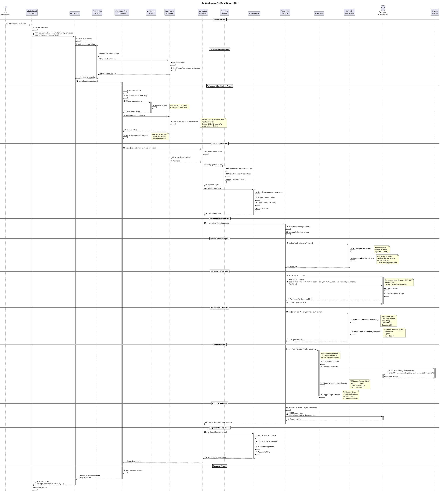
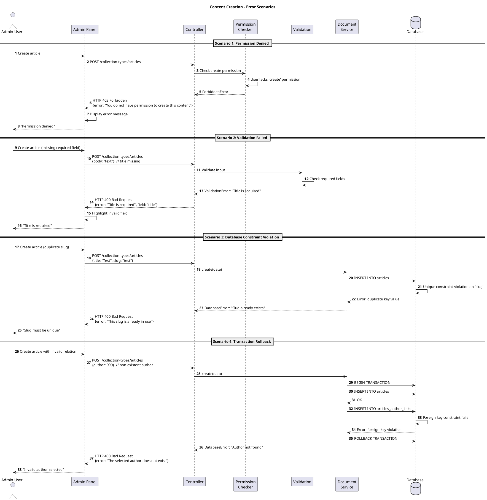

# Sequence Diagram - Content Creation Workflow

## Overview

This document presents the complete sequence diagram for creating content in Strapi v5.31.3, showing all participants, interactions, lifecycle hooks, database transactions, and event emissions throughout the creation flow.

## Workflow Context

**Scenario**: User creates a new content entry via the Admin Panel  
**Content Type**: Collection Type (e.g., Article)  
**Entry Point**: `POST /api/content-manager/collection-types/:uid`  
**Expected Flow**: Request → Validation → Permission Check → Service Layer → Database → Hooks → Response

---

## Sequence Diagram (Complete Flow)



---

## Sequence Diagram (Error Scenarios)



---

## Participants Description

### Frontend Layer

#### Admin User
- **Role**: Content editor, author, administrator
- **Actions**: Fills forms, clicks save button
- **Receives**: Success/error notifications

#### Admin Panel (React)
- **Location**: `packages/core/admin/admin/src`
- **Responsibilities**:
  - Form rendering and validation
  - Client-side data validation
  - API calls via axios
  - State management (Redux)
  - UI feedback (notifications, redirects)

---

### HTTP Layer

#### Koa Router
- **Framework**: Koa.js v2
- **Location**: `packages/core/strapi/src`
- **Responsibilities**:
  - Route matching
  - Middleware execution
  - Policy enforcement
  - Error handling

#### Permission Policy
- **Location**: `packages/core/content-manager/server/src/policies/hasPermissions.ts`
- **Function**: Middleware that checks permissions before controller execution
- **Checks**:
  - User is authenticated
  - User has required permission (create, read, update, delete, publish)
  - Permission scope (all, own, none)
- **Failure**: Returns 403 Forbidden

---

### Controller Layer

#### Collection Types Controller
- **Location**: `packages/core/content-manager/server/src/controllers/collection-types.ts`
- **Method**: `createDocument(ctx, opts)`
- **Responsibilities**:
  - Extract request body
  - Validate and sanitize input
  - Delegate to service layer
  - Format response
  - Handle errors

**Code Reference**:
```typescript
const createDocument = async (ctx: any, opts?: Options) => {
  const { userAbility, user } = ctx.state;
  const { model } = ctx.params;
  const { body } = ctx.request;

  const documentManager = getService('document-manager');
  const permissionChecker = getService('permission-checker').create({ userAbility, model });

  if (permissionChecker.cannot.create()) {
    throw new errors.ForbiddenError();
  }

  const pickPermittedFields = permissionChecker.sanitizeCreateInput;
  const setCreator = setCreatorFields({ user });
  const sanitizeFn = async.pipe(pickPermittedFields, setCreator as any);
  const sanitizedBody = await sanitizeFn(body);

  const { locale, status } = await getDocumentLocaleAndStatus(body, model);

  return documentManager.create(model, {
    data: sanitizedBody as any,
    locale,
    status,
    populate: opts?.populate,
  });
};
```

---

### Business Logic Layer

#### Validation Utils
- **Location**: `packages/core/content-manager/server/src/controllers/validation/`
- **Library**: Joi (schema validation)
- **Validates**:
  - Required fields
  - Data types
  - Format constraints
  - Custom business rules

#### Permission Checker
- **Location**: `packages/core/content-manager/server/src/services/permission-checker.ts`
- **Responsibilities**:
  - Check action permissions (CRUD)
  - Filter fields based on permissions
  - Sanitize input/output
  - Handle field-level permissions

**Permission Levels**:
- **All**: Can create/edit any entry
- **Own**: Can only create/edit own entries
- **None**: No permission

#### Document Manager
- **Location**: `packages/core/content-manager/server/src/services/document-manager.ts`
- **Method**: `create(uid, opts)`
- **Responsibilities**:
  - Orchestrate creation flow
  - Coordinate services
  - Handle populates
  - Trigger events

**Code Reference**:
```typescript
async create(uid: UID.CollectionType, opts: DocServiceParams<'create'> = {} as any) {
  const populate = opts.populate ?? (await buildDeepPopulate(uid));
  const params = { ...opts, status: 'draft' as const, populate };

  return strapi.documents(uid).create(params);
}
```

#### Populate Builder
- **Location**: `packages/core/content-manager/server/src/services/populate-builder.ts`
- **Purpose**: Build relation population queries
- **Features**:
  - Max depth limit (prevents circular refs)
  - Permission-based filtering
  - Selective population

#### Data Mapper
- **Location**: `packages/core/content-manager/server/src/services/data-mapper.ts`
- **Transformations**:
  - Input: API format → Database format
  - Output: Database format → API format
  - Component nesting
  - Media file references
  - Date formatting

---

### Core Services Layer

#### Document Service
- **Location**: `packages/core/core/src/services/document-service/`
- **API**: `strapi.documents(uid).create(params)`
- **Responsibilities**:
  - Low-level CRUD operations
  - Transaction management
  - Lifecycle hook execution
  - Event emission
  - Schema validation

**Lifecycle Hook Sequence**:
1. **beforeCreate**: Before database INSERT
2. **Database Transaction**: INSERT + relations
3. **afterCreate**: After transaction commit
4. **Event Emission**: Async event handlers

#### Event Hub
- **Location**: `packages/core/core/src/services/event-hub/`
- **Framework**: EventEmitter
- **Events Emitted**:
  - `entry.create` - After successful creation
  - `entry.update` - After update
  - `entry.delete` - After deletion
  - `entry.publish` - After publish
  - `entry.unpublish` - After unpublish

**Event Payload**:
```typescript
{
  model: 'article',
  uid: 'api::article.article',
  entry: {
    id: 1,
    documentId: 'abc123',
    title: 'My Article',
    // ...
  }
}
```

#### Lifecycle Subscribers
- **Location**: `packages/core/database/src/lifecycles/subscribers/`
- **Built-in Subscribers**:
  - **Timestamps**: Set createdAt, updatedAt
  - **Audit Log**: Track changes (if enabled)
  - **Search Index**: Update search engines (if configured)

**Custom Subscriber Example**:
```typescript
strapi.db.lifecycles.subscribe({
  models: ['api::article.article'],
  async beforeCreate(event) {
    const { data } = event.params;
    // Generate slug from title
    if (!data.slug && data.title) {
      data.slug = slugify(data.title);
    }
  },
  async afterCreate(event) {
    const { result } = event;
    // Send notification
    await sendNotification(`New article: ${result.title}`);
  }
});
```

---

### Data Layer

#### Database (PostgreSQL)
- **ORM**: Custom Strapi ORM (Knex.js wrapper)
- **Operations**:
  - Transaction management
  - INSERT queries
  - Relation creation (join tables)
  - Constraint enforcement

**Transaction Flow**:
```sql
BEGIN;

-- Main table insert
INSERT INTO articles (
  document_id, title, body, locale, status, 
  created_at, updated_at, created_by, updated_by
) VALUES (
  'abc123', 'My Article', 'Content...', 'en', 'draft',
  '2024-12-12', '2024-12-12', 1, 1
) RETURNING *;

-- Relation insert (if author provided)
INSERT INTO articles_author_links (
  article_id, user_id
) VALUES (1, 5);

COMMIT;
```

---

### Audit & History Layer

#### History Module
- **Location**: `packages/core/content-manager/server/src/history/`
- **Event**: Listens to `entry.create`
- **Action**: Creates version snapshot
- **Database Table**: `strapi_history_versions`

**Version Record**:
```json
{
  "id": 1,
  "contentType": "api::article.article",
  "documentId": "abc123",
  "locale": "en",
  "status": "draft",
  "data": {
    "title": "My Article",
    "body": "Content..."
  },
  "version": 1,
  "createdBy": 1,
  "createdAt": "2024-12-12T10:00:00Z"
}
```

---

## Timing & Performance

### Typical Latency (p50)

| Phase | Duration | Notes |
|-------|----------|-------|
| **Client-side validation** | ~10ms | Instant UI feedback |
| **Network (request)** | ~50ms | Depends on location |
| **Router + Policy** | ~5ms | Fast middleware chain |
| **Controller (validation + sanitization)** | ~10ms | Joi schema validation |
| **Service layer** | ~20ms | Business logic orchestration |
| **Database transaction** | ~50ms | INSERT + relations |
| **Lifecycle hooks** | ~10ms | Timestamp subscriber |
| **Event emission** | ~5ms | Queued async |
| **History version** | ~20ms | Separate INSERT (async) |
| **Network (response)** | ~50ms | JSON serialization + transfer |
| **Total (sync path)** | **~200ms** | User sees success |
| **Total (with async events)** | **~250ms** | Background processing |

### Optimization Strategies

1. **Database Indexes**
   - Index on `documentId` (UUID)
   - Index on `locale` + `status`
   - Index on foreign keys

2. **Populate Optimization**
   - Limit depth to needed levels
   - Use batch loading for relations
   - Select only needed fields

3. **Caching**
   - Cache content type schemas
   - Cache permission queries
   - Cache populated relations (short TTL)

4. **Async Processing**
   - Event handlers run async (after response)
   - History version creation non-blocking
   - Webhook calls queued

---

## Error Handling

### Error Types & HTTP Status Codes

| Error | Status | Scenario |
|-------|--------|----------|
| **ForbiddenError** | 403 | User lacks permission |
| **ValidationError** | 400 | Required field missing, invalid format |
| **DatabaseError** | 400/500 | Unique constraint, foreign key violation |
| **NotFoundError** | 404 | Content type doesn't exist |
| **ApplicationError** | 500 | Unexpected server error |

### Rollback Mechanism

- **Database**: Automatic rollback on transaction error
- **Lifecycle Hooks**: State passed between before/after hooks
- **Events**: Not rolled back (already emitted)

---

## Security Considerations

### Permission Checks
- **Policy Layer**: Initial check (authenticated + hasPermission)
- **Service Layer**: Re-validation before DB operation
- **Field-Level**: Sanitize based on field permissions

### Data Sanitization
- **Input**: Remove unpermitted fields, escape SQL
- **Output**: Filter based on read permissions

### SQL Injection Prevention
- **ORM**: Parameterized queries (Knex.js)
- **Validation**: Type checking before DB

### XSS Prevention
- **Output Encoding**: React auto-escapes
- **Content Security Policy**: Strapi default headers

---

## Extension Points

### Custom Lifecycle Hooks

**Add before creation**:
```typescript
strapi.db.lifecycles.subscribe({
  models: ['api::article.article'],
  async beforeCreate(event) {
    // Validate slug uniqueness
    // Generate SEO meta
    // Call external API
  }
});
```

### Custom Event Listeners

**React to creation**:
```typescript
strapi.eventHub.on('entry.create', async ({ uid, entry }) => {
  if (uid === 'api::article.article') {
    // Send to Algolia
    // Post to Slack
    // Trigger webhook
  }
});
```

### Custom Middlewares

**Add request processing**:
```typescript
strapi.server.use(async (ctx, next) => {
  if (ctx.path.startsWith('/api/content-manager')) {
    // Log request
    // Rate limiting
    // Custom auth
  }
  await next();
});
```

---

## Related Workflows

### Update Workflow
- Similar flow but uses `PUT /collection-types/:uid/:id`
- Includes version check for optimistic locking
- `beforeUpdate` / `afterUpdate` hooks

### Publish Workflow
- Triggered by `POST /collection-types/:uid/:id/actions/publish`
- Changes status from `draft` to `published`
- Sets `publishedAt` timestamp
- Emits `entry.publish` event

### Delete Workflow
- Soft delete (if configured) or hard delete
- Cascades to relations
- History preserved
- `beforeDelete` / `afterDelete` hooks

---

## Testing Strategy

### Unit Tests
```typescript
describe('Document Manager - create', () => {
  it('should create document with valid data', async () => {
    const mockData = { title: 'Test', body: 'Content' };
    const result = await documentManager.create('api::article.article', {
      data: mockData,
      locale: 'en',
      status: 'draft'
    });
    
    expect(result).toHaveProperty('id');
    expect(result.title).toBe('Test');
  });
  
  it('should throw ForbiddenError if no permission', async () => {
    mockPermissionChecker.cannot.create.mockReturnValue(true);
    
    await expect(controller.createDocument(ctx))
      .rejects.toThrow('ForbiddenError');
  });
});
```

### Integration Tests
```typescript
describe('Content Creation API', () => {
  it('POST /api/content-manager/collection-types/articles', async () => {
    const res = await request(strapi.server)
      .post('/api/content-manager/collection-types/api::article.article')
      .set('Authorization', `Bearer ${token}`)
      .send({ title: 'Test', body: 'Content' });
    
    expect(res.status).toBe(201);
    expect(res.body.data).toHaveProperty('documentId');
  });
});
```

---

## Generated Information

**Date**: December 12, 2025  
**Strapi Version**: 5.31.3  
**Diagram Format**: PlantUML Sequence  
**Analysis Method**: Code tracing + Event analysis  
**Validation**: Cross-referenced with actual implementation
