# Entity Relationship Diagram (ERD) - Strapi Core Content Types

## Overview

This document presents the comprehensive Entity Relationship Diagram for Strapi v5.31.3's core content types, including the document versioning system, admin panel entities, plugins, and user management.

## Database Context

**ORM**: Custom Strapi ORM (Knex.js wrapper)  
**Supported Databases**: PostgreSQL, MySQL, MariaDB, SQLite  
**Schema Management**: Migrations + automatic sync  
**Identifier Strategy**: Shortened names when exceeding DB limits

---

## Complete ERD (PlantUML)

```plantuml
@startuml StrapiERD
!define table(x) class x << (T,#FFAAAA) >>
!define pk(x) <u>x</u>
!define fk(x) <i>x</i>
hide methods
hide stereotypes

title Strapi v5.31.3 - Complete Entity Relationship Diagram

' Core Content Tables
table(content_types) {
  pk(id) : INT
  pk(document_id) : UUID
  locale : VARCHAR(10)
  published_at : TIMESTAMP
  created_at : TIMESTAMP
  updated_at : TIMESTAMP
  created_by : INT
  updated_by : INT
  ---
  Custom attributes...
}

table(content_types_components) {
  pk(id) : INT
  fk(entity_id) : INT
  fk(component_id) : INT
  component_type : VARCHAR(255)
  field : VARCHAR(255)
  order : FLOAT
}

table(components) {
  pk(id) : INT
  created_at : TIMESTAMP
  updated_at : TIMESTAMP
  ---
  Component attributes...
}

' History & Versioning
table(strapi_history_versions) {
  pk(id) : INT
  content_type : VARCHAR(255)
  fk(related_document_id) : UUID
  locale : VARCHAR(10)
  status : VARCHAR(50)
  data : JSON
  schema : JSON
  created_at : TIMESTAMP
  fk(created_by) : INT
}

' Admin Users & Auth
table(admin_users) {
  pk(id) : INT
  firstname : VARCHAR(255)
  lastname : VARCHAR(255)
  username : VARCHAR(255)
  email : VARCHAR(255) UNIQUE
  password : VARCHAR(255)
  reset_password_token : VARCHAR(255)
  registration_token : VARCHAR(255)
  is_active : BOOLEAN
  blocked : BOOLEAN
  prefered_language : VARCHAR(10)
  created_at : TIMESTAMP
  updated_at : TIMESTAMP
  fk(created_by) : INT
  fk(updated_by) : INT
}

table(admin_roles) {
  pk(id) : INT
  name : VARCHAR(255) UNIQUE
  code : VARCHAR(255) UNIQUE
  description : TEXT
  created_at : TIMESTAMP
  updated_at : TIMESTAMP
  fk(created_by) : INT
  fk(updated_by) : INT
}

table(admin_permissions) {
  pk(id) : INT
  action : VARCHAR(255)
  subject : VARCHAR(255)
  properties : JSON
  conditions : JSON
  fk(role) : INT
  created_at : TIMESTAMP
  updated_at : TIMESTAMP
  fk(created_by) : INT
  fk(updated_by) : INT
}

table(strapi_users_roles) {
  pk(id) : INT
  fk(user_id) : INT
  fk(role_id) : INT
}

' API Tokens
table(strapi_api_tokens) {
  pk(id) : INT
  name : VARCHAR(255)
  description : TEXT
  type : ENUM('read-only', 'full-access', 'custom')
  access_key : VARCHAR(255) UNIQUE
  last_used_at : TIMESTAMP
  expires_at : TIMESTAMP
  lifespan : BIGINT
  created_at : TIMESTAMP
  updated_at : TIMESTAMP
  fk(created_by) : INT
  fk(updated_by) : INT
}

table(strapi_api_token_permissions) {
  pk(id) : INT
  action : VARCHAR(255)
  fk(token) : INT
  created_at : TIMESTAMP
  updated_at : TIMESTAMP
  fk(created_by) : INT
  fk(updated_by) : INT
}

' Transfer Tokens (for data migration)
table(strapi_transfer_tokens) {
  pk(id) : INT
  name : VARCHAR(255)
  description : TEXT
  access_key : VARCHAR(255) UNIQUE
  last_used_at : TIMESTAMP
  expires_at : TIMESTAMP
  lifespan : BIGINT
  created_at : TIMESTAMP
  updated_at : TIMESTAMP
  fk(created_by) : INT
  fk(updated_by) : INT
}

table(strapi_transfer_token_permissions) {
  pk(id) : INT
  action : VARCHAR(255)
  fk(token) : INT
  created_at : TIMESTAMP
  updated_at : TIMESTAMP
  fk(created_by) : INT
  fk(updated_by) : INT
}

' Upload Plugin
table(files) {
  pk(id) : INT
  pk(document_id) : UUID
  name : VARCHAR(255)
  alternative_text : VARCHAR(255)
  caption : VARCHAR(255)
  width : INT
  height : INT
  formats : JSON
  hash : VARCHAR(255)
  ext : VARCHAR(10)
  mime : VARCHAR(255)
  size : DECIMAL(10,2)
  url : VARCHAR(255)
  preview_url : VARCHAR(255)
  provider : VARCHAR(255)
  provider_metadata : JSON
  fk(folder_id) : INT
  folder_path : VARCHAR(255)
  created_at : TIMESTAMP
  updated_at : TIMESTAMP
  fk(created_by) : INT
  fk(updated_by) : INT
}

table(upload_folders) {
  pk(id) : INT
  pk(document_id) : UUID
  name : VARCHAR(255)
  path_id : INT
  path : VARCHAR(255)
  fk(parent) : INT
  created_at : TIMESTAMP
  updated_at : TIMESTAMP
  fk(created_by) : INT
  fk(updated_by) : INT
}

' Many-to-Many Relations Example
table(files_related_morphs) {
  pk(id) : INT
  fk(file_id) : INT
  related_id : INT
  related_type : VARCHAR(255)
  field : VARCHAR(255)
  order : FLOAT
}

' Review Workflows Plugin
table(strapi_workflows) {
  pk(id) : INT
  pk(document_id) : UUID
  name : VARCHAR(255)
  content_types : JSON
  created_at : TIMESTAMP
  updated_at : TIMESTAMP
  fk(created_by) : INT
  fk(updated_by) : INT
}

table(strapi_workflows_stages) {
  pk(id) : INT
  pk(document_id) : UUID
  name : VARCHAR(255)
  color : VARCHAR(50)
  fk(workflow) : INT
  created_at : TIMESTAMP
  updated_at : TIMESTAMP
  fk(created_by) : INT
  fk(updated_by) : INT
}

table(strapi_workflows_stage_permissions) {
  pk(id) : INT
  fk(stage_id) : INT
  fk(permission_id) : INT
  fk(role_id) : INT
}

' Content Releases Plugin
table(strapi_releases) {
  pk(id) : INT
  pk(document_id) : UUID
  name : VARCHAR(255)
  scheduled_at : TIMESTAMP
  released_at : TIMESTAMP
  timezone : VARCHAR(50)
  status : ENUM('empty', 'ready', 'blocked', 'failed', 'done')
  created_at : TIMESTAMP
  updated_at : TIMESTAMP
  fk(created_by) : INT
  fk(updated_by) : INT
}

table(strapi_release_actions) {
  pk(id) : INT
  pk(document_id) : UUID
  type : ENUM('publish', 'unpublish')
  content_type : VARCHAR(255)
  entry_document_id : UUID
  locale : VARCHAR(10)
  is_entry_valid : BOOLEAN
  fk(release) : INT
  created_at : TIMESTAMP
  updated_at : TIMESTAMP
  fk(created_by) : INT
  fk(updated_by) : INT
}

' Sessions (Admin authentication)
table(strapi_sessions) {
  pk(sid) : VARCHAR(255)
  sess : JSON
  expired : TIMESTAMP
}

' Audit Logs (Enterprise Edition)
table(strapi_audit_logs) {
  pk(id) : INT
  action : VARCHAR(255)
  date : TIMESTAMP
  payload : JSON
  fk(user) : INT
}

' ====== RELATIONSHIPS ======

' Admin Users <-> Roles (Many-to-Many)
admin_users "0..*" -- "0..*" admin_roles : strapi_users_roles
strapi_users_roles -- admin_users : user_id >
strapi_users_roles -- admin_roles : role_id >

' Admin Roles -> Permissions (One-to-Many)
admin_roles "1" -- "0..*" admin_permissions : has

' Admin Users -> Creator Tracking (Self-Referential)
admin_users "1" -- "0..*" admin_users : created_by
admin_users "1" -- "0..*" admin_users : updated_by

' API Tokens -> Permissions (One-to-Many)
strapi_api_tokens "1" -- "0..*" strapi_api_token_permissions : has

' Transfer Tokens -> Permissions (One-to-Many)
strapi_transfer_tokens "1" -- "0..*" strapi_transfer_token_permissions : has

' Content Types -> Components (Many-to-Many)
content_types "0..*" -- "0..*" components : content_types_components
content_types_components -- content_types : entity_id >
content_types_components -- components : component_id >

' Content Types -> History Versions (One-to-Many)
content_types "1" -- "0..*" strapi_history_versions : related_document_id

' Upload: Files <-> Related Entities (Polymorphic Many-to-Many)
files "0..*" -- "0..*" content_types : files_related_morphs

' Upload: Folders (Self-Referential Tree)
upload_folders "1" -- "0..*" upload_folders : parent
upload_folders "1" -- "0..*" files : folder_id

' Workflows -> Stages (One-to-Many)
strapi_workflows "1" -- "0..*" strapi_workflows_stages : has

' Workflow Stages -> Permissions (Many-to-Many)
strapi_workflows_stages "0..*" -- "0..*" admin_permissions : strapi_workflows_stage_permissions
strapi_workflows_stage_permissions -- strapi_workflows_stages : stage_id >
strapi_workflows_stage_permissions -- admin_permissions : permission_id >
strapi_workflows_stage_permissions -- admin_roles : role_id >

' Releases -> Actions (One-to-Many)
strapi_releases "1" -- "0..*" strapi_release_actions : release

' Creator Tracking (Many Tables)
admin_users "1" -- "0..*" content_types : created_by
admin_users "1" -- "0..*" content_types : updated_by
admin_users "1" -- "0..*" strapi_history_versions : created_by
admin_users "1" -- "0..*" files : created_by
admin_users "1" -- "0..*" files : updated_by

@enduml
```



---

## Table Descriptions

### Core Content Tables

#### Content Types (Generic)
- **Table Name**: Dynamically generated (e.g., `articles`, `products`)
- **Purpose**: Stores actual user-defined content
- **Document System**: Uses `document_id` (UUID) for version grouping
- **Localization**: `locale` field for i18n support
- **Draft/Publish**: `published_at` NULL = draft, NOT NULL = published

**Standard Columns**:
```sql
CREATE TABLE articles (
  id SERIAL PRIMARY KEY,
  document_id UUID NOT NULL,  -- Groups versions of same content
  locale VARCHAR(10) DEFAULT 'en',
  published_at TIMESTAMP NULL,  -- NULL = draft, NOT NULL = published
  created_at TIMESTAMP DEFAULT NOW(),
  updated_at TIMESTAMP DEFAULT NOW(),
  created_by INT REFERENCES admin_users(id),
  updated_by INT REFERENCES admin_users(id),
  
  -- Custom fields defined by user
  title VARCHAR(255),
  body TEXT,
  slug VARCHAR(255) UNIQUE,
  -- ... more custom fields
  
  INDEX idx_documents (document_id, locale, published_at)
);
```

**Document ID Concept**:
- Single document can have multiple rows (versions):
  - Different locales: `en`, `fr`, `es`
  - Different statuses: `draft` (published_at = NULL), `published` (published_at = TIMESTAMP)
- Example:
  ```sql
  document_id | locale | published_at    | title
  ------------|--------|-----------------|-------
  uuid-123    | en     | NULL           | Draft English
  uuid-123    | en     | 2024-12-12...  | Published English
  uuid-123    | fr     | NULL           | Draft French
  uuid-123    | fr     | 2024-12-12...  | Published French
  ```

---

#### Components Join Table
- **Table Name**: `{content_type}_components` (e.g., `articles_components`)
- **Purpose**: Many-to-many relation between content and reusable components
- **Polymorphic**: `component_type` determines which component table

**Schema**:
```sql
CREATE TABLE articles_components (
  id SERIAL PRIMARY KEY,
  entity_id INT NOT NULL REFERENCES articles(id) ON DELETE CASCADE,
  component_id INT NOT NULL,  -- Links to specific component table
  component_type VARCHAR(255) NOT NULL,  -- e.g., 'default.seo', 'blog.author-bio'
  field VARCHAR(255) NOT NULL,  -- Which field in article (e.g., 'seo', 'sidebar')
  order FLOAT,  -- For repeatable components (order in list)
  
  INDEX idx_field (field),
  INDEX idx_component_type (component_type),
  INDEX idx_entity_fk (entity_id),
  UNIQUE (entity_id, component_id, field, component_type)
);
```

**Example**:
```json
// Article has SEO component and multiple Gallery components
articles_components:
[
  {entity_id: 1, component_id: 5, component_type: 'default.seo', field: 'seo', order: null},
  {entity_id: 1, component_id: 10, component_type: 'media.gallery', field: 'gallery', order: 1},
  {entity_id: 1, component_id: 11, component_type: 'media.gallery', field: 'gallery', order: 2}
]
```

---

#### Components Tables
- **Table Name**: `components_{category}_{name}` (e.g., `components_blog_author_bios`)
- **Purpose**: Stores reusable component data
- **Shared Across Content**: Same component can be used in multiple content types

**Example Component Schema**:
```sql
CREATE TABLE components_blog_author_bios (
  id SERIAL PRIMARY KEY,
  name VARCHAR(255),
  bio TEXT,
  avatar_id INT REFERENCES files(id),
  created_at TIMESTAMP DEFAULT NOW(),
  updated_at TIMESTAMP DEFAULT NOW()
);
```

---

### History & Versioning

#### History Versions
- **Table**: `strapi_history_versions`
- **Purpose**: Audit trail and version snapshots
- **Trigger**: Created on every content update
- **Retention**: Configurable (default: keep all)

**Schema**:
```sql
CREATE TABLE strapi_history_versions (
  id SERIAL PRIMARY KEY,
  content_type VARCHAR(255) NOT NULL,  -- e.g., 'api::article.article'
  related_document_id UUID NOT NULL,   -- References content document_id
  locale VARCHAR(10),
  status VARCHAR(50),  -- 'draft', 'published'
  data JSON NOT NULL,  -- Full snapshot of content at this version
  schema JSON,         -- Content type schema at time of version
  created_at TIMESTAMP DEFAULT NOW(),
  created_by INT REFERENCES admin_users(id),
  
  INDEX idx_content (content_type, related_document_id),
  INDEX idx_created_at (created_at)
);
```

**Usage**:
- **Version History**: See all changes to a document over time
- **Restore**: Roll back to previous version
- **Audit**: Who changed what and when
- **Compare**: Diff between versions

---

### Admin & Authentication

#### Admin Users
- **Table**: `admin_users`
- **Purpose**: Strapi admin panel users (content editors, administrators)
- **Authentication**: Email/password (bcrypt)
- **Distinct From**: API users (users-permissions plugin)

**Schema**:
```sql
CREATE TABLE admin_users (
  id SERIAL PRIMARY KEY,
  firstname VARCHAR(255),
  lastname VARCHAR(255),
  username VARCHAR(255),
  email VARCHAR(255) UNIQUE NOT NULL,
  password VARCHAR(255) NOT NULL,  -- bcrypt hash
  reset_password_token VARCHAR(255),
  registration_token VARCHAR(255),
  is_active BOOLEAN DEFAULT TRUE,
  blocked BOOLEAN DEFAULT FALSE,
  prefered_language VARCHAR(10) DEFAULT 'en',
  created_at TIMESTAMP DEFAULT NOW(),
  updated_at TIMESTAMP DEFAULT NOW(),
  created_by INT REFERENCES admin_users(id),
  updated_by INT REFERENCES admin_users(id),
  
  INDEX idx_email (email),
  INDEX idx_reset_token (reset_password_token)
);
```

---

#### Admin Roles
- **Table**: `admin_roles`
- **Purpose**: RBAC for admin users
- **Built-in Roles**: Super Admin, Editor, Author
- **Custom Roles**: User-defined with granular permissions

**Schema**:
```sql
CREATE TABLE admin_roles (
  id SERIAL PRIMARY KEY,
  name VARCHAR(255) UNIQUE NOT NULL,
  code VARCHAR(255) UNIQUE NOT NULL,  -- e.g., 'strapi-super-admin'
  description TEXT,
  created_at TIMESTAMP DEFAULT NOW(),
  updated_at TIMESTAMP DEFAULT NOW(),
  created_by INT REFERENCES admin_users(id),
  updated_by INT REFERENCES admin_users(id)
);
```

**Default Roles**:
| ID | Name | Code | Permissions |
|----|------|------|-------------|
| 1 | Super Admin | strapi-super-admin | All |
| 2 | Editor | strapi-editor | Manage content |
| 3 | Author | strapi-author | Create/edit own content |

---

#### Admin Permissions
- **Table**: `admin_permissions`
- **Purpose**: Fine-grained permissions for admin panel actions
- **Scope**: Content types, plugins, settings

**Schema**:
```sql
CREATE TABLE admin_permissions (
  id SERIAL PRIMARY KEY,
  action VARCHAR(255) NOT NULL,  -- e.g., 'plugin::content-manager.explorer.create'
  subject VARCHAR(255),  -- e.g., 'api::article.article'
  properties JSON,  -- Field-level permissions: {"fields": ["title", "body"]}
  conditions JSON,  -- Conditions: {"$own": true}  (only own content)
  role INT REFERENCES admin_roles(id) ON DELETE CASCADE,
  created_at TIMESTAMP DEFAULT NOW(),
  updated_at TIMESTAMP DEFAULT NOW(),
  created_by INT REFERENCES admin_users(id),
  updated_by INT REFERENCES admin_users(id),
  
  INDEX idx_role (role),
  INDEX idx_action (action)
);
```

**Permission Actions**:
- `plugin::content-manager.explorer.create`
- `plugin::content-manager.explorer.read`
- `plugin::content-manager.explorer.update`
- `plugin::content-manager.explorer.delete`
- `plugin::content-manager.explorer.publish`
- `plugin::upload.read`
- `admin::users.create`

**Conditions** (JSON):
```json
{
  "$own": true  // User can only manage their own content
}
```

**Properties** (JSON):
```json
{
  "fields": ["title", "body"],  // Only these fields editable
  "locales": ["en", "fr"]       // Only these locales accessible
}
```

---

#### Users-Roles Join Table
- **Table**: `strapi_users_roles`
- **Purpose**: Many-to-many relation between users and roles
- **Single User**: Can have multiple roles (permissions merged)

**Schema**:
```sql
CREATE TABLE strapi_users_roles (
  id SERIAL PRIMARY KEY,
  user_id INT NOT NULL REFERENCES admin_users(id) ON DELETE CASCADE,
  role_id INT NOT NULL REFERENCES admin_roles(id) ON DELETE CASCADE,
  
  UNIQUE (user_id, role_id),
  INDEX idx_user (user_id),
  INDEX idx_role (role_id)
);
```

---

### API & Transfer Tokens

#### API Tokens
- **Table**: `strapi_api_tokens`
- **Purpose**: Programmatic API access (headless CMS clients)
- **Types**: Read-only, Full-access, Custom
- **Authentication**: Bearer token (`Authorization: Bearer {access_key}`)

**Schema**:
```sql
CREATE TABLE strapi_api_tokens (
  id SERIAL PRIMARY KEY,
  name VARCHAR(255) NOT NULL,
  description TEXT,
  type ENUM('read-only', 'full-access', 'custom') NOT NULL,
  access_key VARCHAR(255) UNIQUE NOT NULL,  -- SHA256 hash
  last_used_at TIMESTAMP,
  expires_at TIMESTAMP,
  lifespan BIGINT,  -- Milliseconds
  created_at TIMESTAMP DEFAULT NOW(),
  updated_at TIMESTAMP DEFAULT NOW(),
  created_by INT REFERENCES admin_users(id),
  updated_by INT REFERENCES admin_users(id),
  
  INDEX idx_access_key (access_key)
);
```

---

#### Transfer Tokens
- **Table**: `strapi_transfer_tokens`
- **Purpose**: Data migration between Strapi instances
- **Use Case**: Import/export content, sync environments

**Schema**: Similar to API tokens with transfer-specific permissions

---

### Upload Plugin

#### Files
- **Table**: `files`
- **Purpose**: Media library (images, videos, documents)
- **Providers**: Local, AWS S3, Cloudinary, etc.
- **Formats**: Responsive image thumbnails (JSON)

**Schema**:
```sql
CREATE TABLE files (
  id SERIAL PRIMARY KEY,
  document_id UUID,
  name VARCHAR(255) NOT NULL,
  alternative_text VARCHAR(255),
  caption VARCHAR(255),
  width INT,
  height INT,
  formats JSON,  -- {"thumbnail": {...}, "small": {...}, "medium": {...}}
  hash VARCHAR(255) UNIQUE NOT NULL,
  ext VARCHAR(10),
  mime VARCHAR(255) NOT NULL,
  size DECIMAL(10,2) NOT NULL,  -- KB
  url VARCHAR(255) NOT NULL,
  preview_url VARCHAR(255),
  provider VARCHAR(255) DEFAULT 'local',
  provider_metadata JSON,
  folder_id INT REFERENCES upload_folders(id) ON DELETE SET NULL,
  folder_path VARCHAR(255),
  created_at TIMESTAMP DEFAULT NOW(),
  updated_at TIMESTAMP DEFAULT NOW(),
  created_by INT REFERENCES admin_users(id),
  updated_by INT REFERENCES admin_users(id),
  
  INDEX idx_name (name),
  INDEX idx_hash (hash),
  INDEX idx_folder (folder_id)
);
```

**Formats JSON Example**:
```json
{
  "thumbnail": {
    "name": "thumbnail_image.jpg",
    "hash": "thumbnail_xyz123",
    "ext": ".jpg",
    "mime": "image/jpeg",
    "width": 156,
    "height": 156,
    "size": 5.2,
    "url": "/uploads/thumbnail_image.jpg"
  },
  "small": {...},
  "medium": {...},
  "large": {...}
}
```

---

#### Upload Folders
- **Table**: `upload_folders`
- **Purpose**: Hierarchical folder structure for media organization
- **Self-Referential**: `parent` field creates tree

**Schema**:
```sql
CREATE TABLE upload_folders (
  id SERIAL PRIMARY KEY,
  document_id UUID,
  name VARCHAR(255) NOT NULL,
  path_id INT UNIQUE,
  path VARCHAR(255) UNIQUE,  -- e.g., '/images/blog'
  parent INT REFERENCES upload_folders(id) ON DELETE CASCADE,
  created_at TIMESTAMP DEFAULT NOW(),
  updated_at TIMESTAMP DEFAULT NOW(),
  created_by INT REFERENCES admin_users(id),
  updated_by INT REFERENCES admin_users(id),
  
  INDEX idx_parent (parent),
  INDEX idx_path (path)
);
```

---

#### Files Related Morphs
- **Table**: `files_related_morphs`
- **Purpose**: Polymorphic many-to-many relation between files and any content
- **Use Case**: Attach images to articles, products, users, etc.

**Schema**:
```sql
CREATE TABLE files_related_morphs (
  id SERIAL PRIMARY KEY,
  file_id INT NOT NULL REFERENCES files(id) ON DELETE CASCADE,
  related_id INT NOT NULL,  -- ID of related entity (article, product, etc.)
  related_type VARCHAR(255) NOT NULL,  -- e.g., 'api::article.article'
  field VARCHAR(255) NOT NULL,  -- Which field (e.g., 'cover_image', 'gallery')
  order FLOAT,  -- For multiple files
  
  INDEX idx_file (file_id),
  INDEX idx_related (related_type, related_id),
  INDEX idx_field (field)
);
```

**Example**:
```sql
-- Article #1 has cover image (file #10) and 2 gallery images (files #11, #12)
INSERT INTO files_related_morphs VALUES
  (1, 10, 1, 'api::article.article', 'cover_image', null),
  (2, 11, 1, 'api::article.article', 'gallery', 1),
  (3, 12, 1, 'api::article.article', 'gallery', 2);
```

---

### Review Workflows Plugin

#### Workflows
- **Table**: `strapi_workflows`
- **Purpose**: Define multi-stage approval processes
- **Example Workflow**: Draft → In Review → Approved → Published

**Schema**:
```sql
CREATE TABLE strapi_workflows (
  id SERIAL PRIMARY KEY,
  document_id UUID,
  name VARCHAR(255) NOT NULL,
  content_types JSON NOT NULL,  -- ["api::article.article", "api::page.page"]
  created_at TIMESTAMP DEFAULT NOW(),
  updated_at TIMESTAMP DEFAULT NOW(),
  created_by INT REFERENCES admin_users(id),
  updated_by INT REFERENCES admin_users(id),
  
  INDEX idx_name (name)
);
```

---

#### Workflow Stages
- **Table**: `strapi_workflows_stages`
- **Purpose**: Individual stages in a workflow
- **Permissions**: Role-based access per stage

**Schema**:
```sql
CREATE TABLE strapi_workflows_stages (
  id SERIAL PRIMARY KEY,
  document_id UUID,
  name VARCHAR(255) NOT NULL,
  color VARCHAR(50),  -- UI display color
  workflow INT NOT NULL REFERENCES strapi_workflows(id) ON DELETE CASCADE,
  created_at TIMESTAMP DEFAULT NOW(),
  updated_at TIMESTAMP DEFAULT NOW(),
  created_by INT REFERENCES admin_users(id),
  updated_by INT REFERENCES admin_users(id),
  
  INDEX idx_workflow (workflow)
);
```

**Example Stages**:
| ID | Name | Color | Workflow |
|----|------|-------|----------|
| 1 | Draft | #EEEEEE | 1 |
| 2 | In Review | #FFCC00 | 1 |
| 3 | Approved | #00FF00 | 1 |
| 4 | Published | #0000FF | 1 |

---

### Content Releases Plugin

#### Releases
- **Table**: `strapi_releases`
- **Purpose**: Batch publish/unpublish content at scheduled time
- **Use Case**: Marketing campaigns, product launches

**Schema**:
```sql
CREATE TABLE strapi_releases (
  id SERIAL PRIMARY KEY,
  document_id UUID,
  name VARCHAR(255) NOT NULL,
  scheduled_at TIMESTAMP,  -- When to publish (NULL = manual)
  released_at TIMESTAMP,   -- When actually published (NULL = not yet)
  timezone VARCHAR(50),
  status ENUM('empty', 'ready', 'blocked', 'failed', 'done') DEFAULT 'empty',
  created_at TIMESTAMP DEFAULT NOW(),
  updated_at TIMESTAMP DEFAULT NOW(),
  created_by INT REFERENCES admin_users(id),
  updated_by INT REFERENCES admin_users(id),
  
  INDEX idx_scheduled (scheduled_at),
  INDEX idx_status (status)
);
```

---

#### Release Actions
- **Table**: `strapi_release_actions`
- **Purpose**: Individual content items in a release
- **Actions**: Publish or unpublish specific documents

**Schema**:
```sql
CREATE TABLE strapi_release_actions (
  id SERIAL PRIMARY KEY,
  document_id UUID,
  type ENUM('publish', 'unpublish') NOT NULL,
  content_type VARCHAR(255) NOT NULL,  -- e.g., 'api::article.article'
  entry_document_id UUID NOT NULL,  -- Which content to publish/unpublish
  locale VARCHAR(10),
  is_entry_valid BOOLEAN DEFAULT TRUE,  -- Pre-publish validation
  release INT NOT NULL REFERENCES strapi_releases(id) ON DELETE CASCADE,
  created_at TIMESTAMP DEFAULT NOW(),
  updated_at TIMESTAMP DEFAULT NOW(),
  created_by INT REFERENCES admin_users(id),
  updated_by INT REFERENCES admin_users(id),
  
  INDEX idx_release (release),
  INDEX idx_entry (content_type, entry_document_id)
);
```

**Workflow**:
1. Create release: "Black Friday 2024"
2. Add actions:
   - Publish `article/uuid-123` (Black Friday landing page)
   - Publish `product/uuid-456` (Special offer product)
   - Unpublish `article/uuid-789` (Old promotion)
3. Schedule: `2024-11-24 00:00:00`
4. System publishes all at scheduled time

---

### Sessions

#### Strapi Sessions
- **Table**: `strapi_sessions`
- **Purpose**: Admin panel session storage (connect-session-knex)
- **Expiry**: Automatic cleanup of expired sessions

**Schema**:
```sql
CREATE TABLE strapi_sessions (
  sid VARCHAR(255) PRIMARY KEY,  -- Session ID (UUID)
  sess JSON NOT NULL,  -- Session data (user ID, etc.)
  expired TIMESTAMP NOT NULL,  -- Expiration time
  
  INDEX idx_expired (expired)
);
```

---

### Audit Logs (Enterprise Edition)

#### Audit Logs
- **Table**: `strapi_audit_logs`
- **Purpose**: Compliance, security auditing
- **Captured**: All admin actions (create, update, delete, login)

**Schema**:
```sql
CREATE TABLE strapi_audit_logs (
  id SERIAL PRIMARY KEY,
  action VARCHAR(255) NOT NULL,  -- e.g., 'entry.create', 'user.login'
  date TIMESTAMP NOT NULL DEFAULT NOW(),
  payload JSON,  -- Details of action
  user INT REFERENCES admin_users(id) ON DELETE SET NULL,
  
  INDEX idx_action (action),
  INDEX idx_date (date),
  INDEX idx_user (user)
);
```

---

## Relationship Summary

### One-to-Many Relationships

| Parent Table | Child Table | Foreign Key | Delete Rule |
|--------------|-------------|-------------|-------------|
| admin_roles | admin_permissions | role | CASCADE |
| strapi_workflows | strapi_workflows_stages | workflow | CASCADE |
| strapi_releases | strapi_release_actions | release | CASCADE |
| upload_folders | upload_folders | parent | CASCADE |
| upload_folders | files | folder_id | SET NULL |
| admin_users | * (creator tracking) | created_by | SET NULL |

### Many-to-Many Relationships

| Table 1 | Table 2 | Join Table | Description |
|---------|---------|------------|-------------|
| admin_users | admin_roles | strapi_users_roles | User role assignments |
| content_types | components | {ct}_components | Content component relations |
| files | * (any content) | files_related_morphs | Polymorphic file attachments |
| strapi_workflows_stages | admin_permissions | strapi_workflows_stage_permissions | Stage access control |

### Self-Referential Relationships

| Table | Field | Purpose |
|-------|-------|---------|
| admin_users | created_by, updated_by | Track who modified |
| upload_folders | parent | Folder hierarchy |

---

## Indexes Strategy

### Performance Indexes

**Content Tables**:
```sql
-- Document lookup
CREATE INDEX idx_documents ON articles(document_id, locale, published_at);

-- Full-text search (PostgreSQL)
CREATE INDEX idx_title_search ON articles USING GIN(to_tsvector('english', title));

-- Filtering
CREATE INDEX idx_published_at ON articles(published_at);
CREATE INDEX idx_locale ON articles(locale);
```

**Component Join Tables**:
```sql
CREATE INDEX idx_entity_id ON articles_components(entity_id);
CREATE INDEX idx_component_type ON articles_components(component_type);
CREATE INDEX idx_field ON articles_components(field);
```

**History**:
```sql
CREATE INDEX idx_history_lookup ON strapi_history_versions(content_type, related_document_id, created_at DESC);
```

**Upload**:
```sql
CREATE INDEX idx_file_hash ON files(hash);
CREATE INDEX idx_file_folder ON files(folder_id);
CREATE INDEX idx_file_mime ON files(mime);
```

---

## Data Integrity Constraints

### Unique Constraints

```sql
-- Admin
ALTER TABLE admin_users ADD CONSTRAINT uq_email UNIQUE (email);
ALTER TABLE admin_roles ADD CONSTRAINT uq_name UNIQUE (name);
ALTER TABLE admin_roles ADD CONSTRAINT uq_code UNIQUE (code);

-- Tokens
ALTER TABLE strapi_api_tokens ADD CONSTRAINT uq_access_key UNIQUE (access_key);
ALTER TABLE strapi_transfer_tokens ADD CONSTRAINT uq_access_key UNIQUE (access_key);

-- Upload
ALTER TABLE files ADD CONSTRAINT uq_hash UNIQUE (hash);
ALTER TABLE upload_folders ADD CONSTRAINT uq_path UNIQUE (path);

-- Components
ALTER TABLE articles_components ADD CONSTRAINT uq_component_link UNIQUE (entity_id, component_id, field, component_type);
```

### Check Constraints

```sql
-- Validate email format
ALTER TABLE admin_users ADD CONSTRAINT chk_email CHECK (email ~* '^[A-Za-z0-9._%+-]+@[A-Za-z0-9.-]+\.[A-Z|a-z]{2,}$');

-- File size positive
ALTER TABLE files ADD CONSTRAINT chk_size CHECK (size > 0);

-- Workflow status enum
ALTER TABLE strapi_releases ADD CONSTRAINT chk_status CHECK (status IN ('empty', 'ready', 'blocked', 'failed', 'done'));

-- Token types
ALTER TABLE strapi_api_tokens ADD CONSTRAINT chk_type CHECK (type IN ('read-only', 'full-access', 'custom'));
```

---

## Migration Strategy

### Version Control
- **Tool**: Strapi Migrations (built-in)
- **Location**: `database/migrations/`
- **Naming**: `{timestamp}.{name}.js`

**Example Migration**:
```javascript
// database/migrations/2024.12.12T10.00.00.add-slug-to-articles.js
module.exports = {
  async up(knex) {
    await knex.schema.table('articles', (table) => {
      table.string('slug').unique();
      table.index('slug');
    });
  },
  
  async down(knex) {
    await knex.schema.table('articles', (table) => {
      table.dropColumn('slug');
    });
  }
};
```

### Auto-Sync vs Migrations
- **Development**: Auto-sync (schema automatically updated)
- **Production**: Migrations only (controlled changes)
- **Configuration**: `database.settings.runMigrations`

---

## Database Optimization

### Query Optimization

**Populate Relations**:
```javascript
// Inefficient (N+1 queries)
const articles = await strapi.db.query('api::article.article').findMany();
for (const article of articles) {
  article.author = await strapi.db.query('api::author.author').findOne({ where: { id: article.author_id } });
}

// Efficient (1 query with join)
const articles = await strapi.db.query('api::article.article').findMany({
  populate: { author: true }
});
```

**Pagination**:
```javascript
// Always use pagination for large datasets
const { results, pagination } = await strapi.db.query('api::article.article').findPage({
  page: 1,
  pageSize: 10
});
```

### Caching Strategy

**Content Type Schemas**:
- Cached in memory on startup
- Invalidated when schema changes

**Permissions**:
- Cached per request
- Cleared on role/permission changes

**Files**:
- CDN for media (Cloudinary, S3)
- Thumbnails pre-generated

---

## Security Considerations

### Password Storage
- **Algorithm**: bcrypt
- **Salt Rounds**: 10 (configurable)
- **Never Plain Text**

### Token Security
- **API Tokens**: SHA256 hashed
- **Access Keys**: 256-bit random
- **Rotation**: Supported

### SQL Injection Prevention
- **ORM**: All queries parameterized
- **Raw Queries**: Use bindings (`knex.raw('SELECT * FROM ?? WHERE ?? = ?', [table, col, val])`)

### GDPR Compliance
- **User Data**: Exportable via API
- **Right to Delete**: Cascade deletions
- **Audit Logs**: Track all access

---

## Generated Information

**Date**: December 12, 2025  
**Strapi Version**: 5.31.3  
**Diagram Format**: PlantUML ERD  
**Database**: PostgreSQL/MySQL/MariaDB/SQLite  
**Analysis Method**: Schema inspection + Code analysis  
**Validation**: Cross-referenced with actual database migrations
