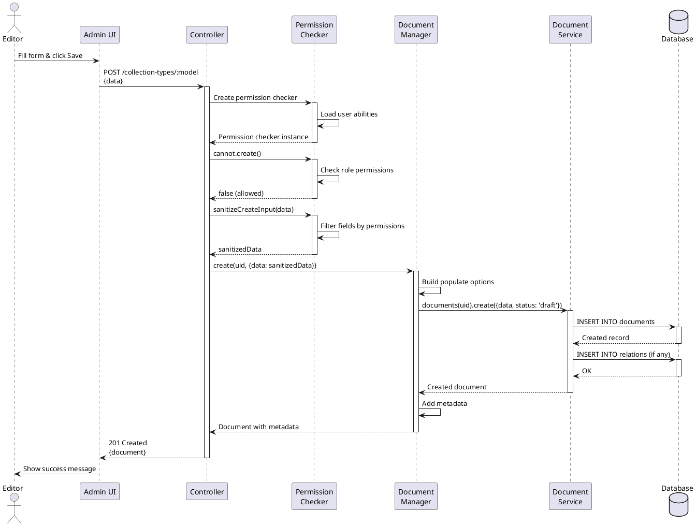
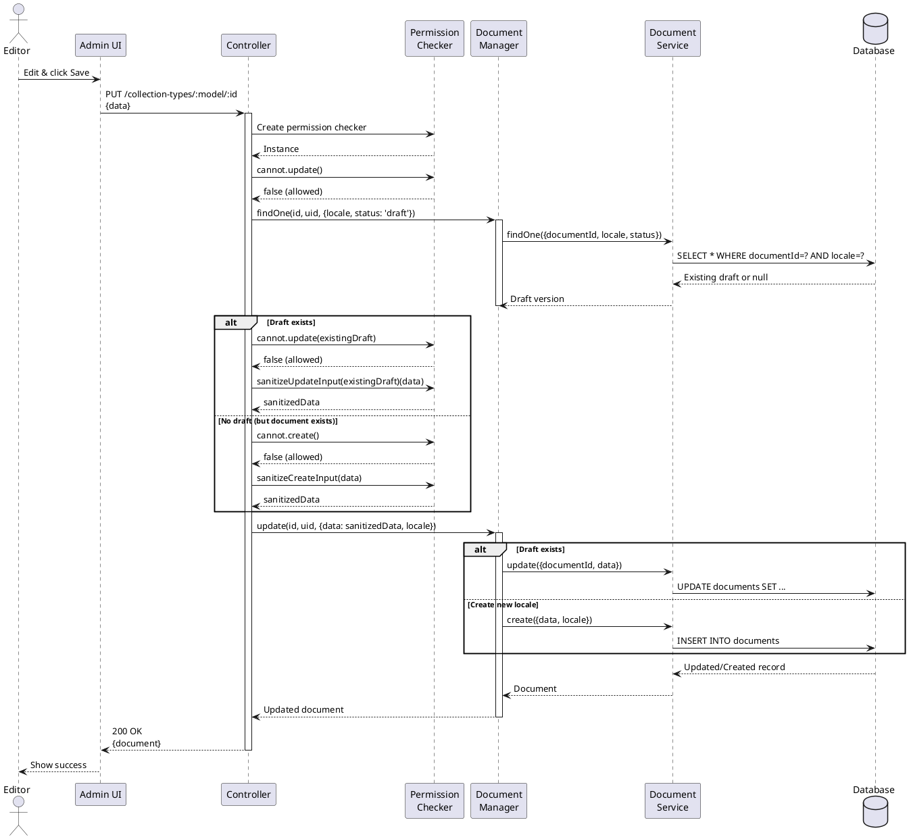
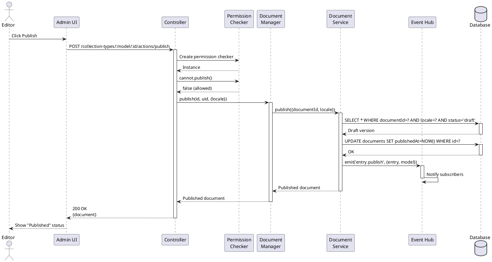
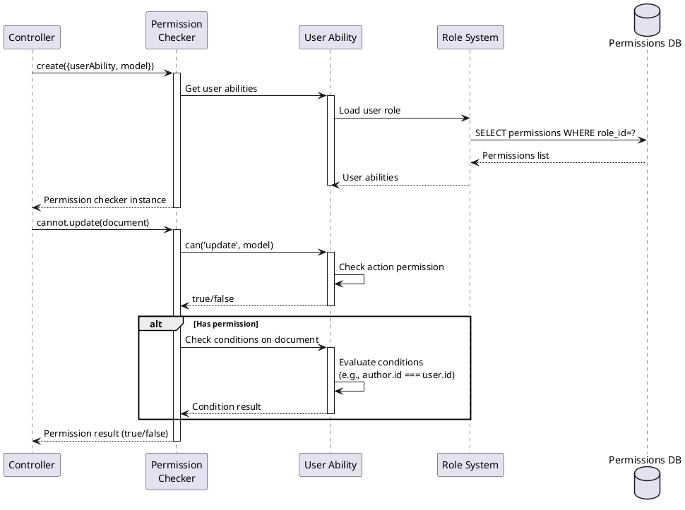
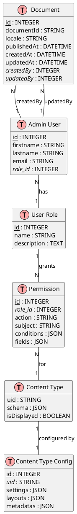
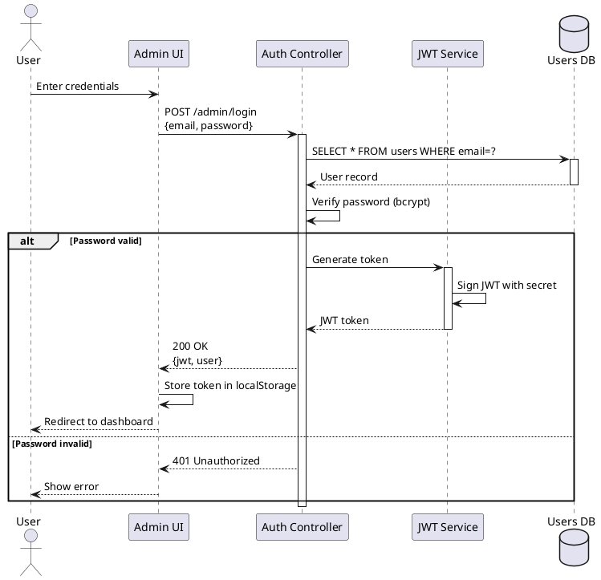
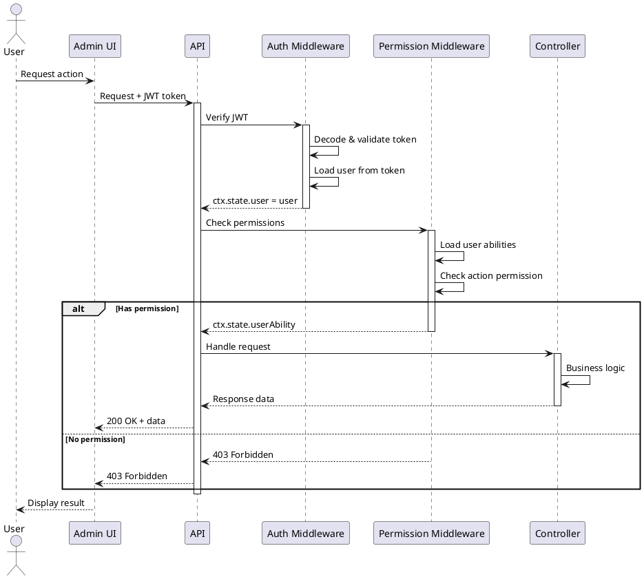

# Content Manager - Architecture Documentation

Detailed architecture documentation for Strapi Content Manager plugin.

**Version**: 5.31.3  
**Last Updated**: December 12, 2025

---

## Table of Contents

1. [System Architecture](#system-architecture)
2. [Component Diagrams](#component-diagrams)
3. [Sequence Diagrams](#sequence-diagrams)
4. [Data Models](#data-models)
5. [Design Patterns](#design-patterns)
6. [Integration Architecture](#integration-architecture)
7. [Security Architecture](#security-architecture)

---

## System Architecture

### High-Level Architecture (C4 Context)

```plantuml
@startuml
!include https://raw.githubusercontent.com/plantuml-stdlib/C4-PlantUML/master/C4_Context.puml

LAYOUT_WITH_LEGEND()

Person(admin, "Administrator", "Manages content and configuration")
Person(editor, "Content Editor", "Creates and publishes content")
Person(enduser, "End User", "Consumes published content")

System(cms, "Strapi CMS", "Headless content management system")
System_Ext(frontend, "Frontend Application", "Website/Mobile App")
System_Ext(cdn, "CDN", "Content delivery network")

Rel(admin, cms, "Manages", "HTTPS")
Rel(editor, cms, "Creates content", "HTTPS")
Rel(frontend, cms, "Fetches content", "REST/GraphQL")
Rel(enduser, frontend, "Views", "HTTPS")
Rel(frontend, cdn, "Fetches media", "HTTPS")
Rel(cms, cdn, "Uploads media", "S3 API")

@enduml
```

---

### Container Diagram (C4 Container)

```plantuml
@startuml
!include https://raw.githubusercontent.com/plantuml-stdlib/C4-PlantUML/master/C4_Container.puml

LAYOUT_WITH_LEGEND()

Person(editor, "Content Editor")

System_Boundary(strapi, "Strapi CMS") {
    Container(admin_ui, "Admin Panel", "React", "Content editing interface")
    Container(content_manager, "Content Manager", "Node.js", "Core content management logic")
    Container(api_server, "API Server", "Koa", "REST/GraphQL API")
    Container(auth, "Auth System", "Node.js", "Authentication & authorization")
    ContainerDb(db, "Database", "PostgreSQL/MySQL", "Stores content data")
    ContainerDb(redis, "Cache", "Redis", "Session & query cache")
}

System_Ext(cdn, "CDN/Storage", "S3-compatible")

Rel(editor, admin_ui, "Uses", "HTTPS")
Rel(admin_ui, content_manager, "Calls", "HTTP/JSON")
Rel(content_manager, api_server, "Uses")
Rel(content_manager, auth, "Validates", "JWT")
Rel(content_manager, db, "Reads/Writes", "SQL")
Rel(content_manager, redis, "Caches", "Redis Protocol")
Rel(api_server, cdn, "Uploads", "S3 API")

@enduml
```

---

## Component Diagrams

### Content Manager Components (C4 Component)

```plantuml
@startuml
!include https://raw.githubusercontent.com/plantuml-stdlib/C4-PlantUML/master/C4_Component.puml

LAYOUT_WITH_LEGEND()

Container_Boundary(cm, "Content Manager Plugin") {
    Component(controllers, "Controllers", "Node.js", "Handle HTTP requests")
    Component(doc_mgr, "Document Manager", "Service", "CRUD operations")
    Component(perm_checker, "Permission Checker", "Service", "Authorization")
    Component(pop_builder, "Populate Builder", "Service", "Query building")
    Component(metadata, "Metadata Service", "Service", "Document metadata")
    Component(validation, "Validation", "Yup", "Input validation")
    Component(routes, "Routes", "Koa Router", "API endpoints")
}

Container_Ext(doc_service, "Document Service", "Strapi Core")
Container_Ext(db_query, "Database Query", "Strapi Core")
ContainerDb(database, "Database")

Rel(routes, controllers, "Routes to")
Rel(controllers, doc_mgr, "Uses")
Rel(controllers, perm_checker, "Uses")
Rel(controllers, validation, "Uses")
Rel(doc_mgr, pop_builder, "Uses")
Rel(doc_mgr, metadata, "Uses")
Rel(doc_mgr, doc_service, "Calls")
Rel(doc_service, db_query, "Uses")
Rel(db_query, database, "Queries")
Rel(perm_checker, doc_service, "Reads")

@enduml
```

---

### Service Layer Architecture

```
┌─────────────────────────────────────────────────────────────┐
│                    Controllers Layer                         │
│  ┌──────────────┐  ┌──────────────┐  ┌──────────────┐      │
│  │ Collection   │  │ Single Type  │  │  Components  │      │
│  │ Types        │  │              │  │              │      │
│  └──────┬───────┘  └──────┬───────┘  └──────┬───────┘      │
└─────────┼──────────────────┼──────────────────┼─────────────┘
          │                  │                  │
          ▼                  ▼                  ▼
┌─────────────────────────────────────────────────────────────┐
│                     Services Layer                           │
│  ┌──────────────────────────────────────────────────────┐   │
│  │              Document Manager Service                 │   │
│  │  • findOne()      • create()      • publish()        │   │
│  │  • findMany()     • update()      • unpublish()      │   │
│  │  • findPage()     • delete()      • clone()          │   │
│  └─────────┬───────────────────────────────────┬────────┘   │
│            │                                    │            │
│  ┌─────────▼──────────┐              ┌─────────▼─────────┐  │
│  │ Permission Checker │              │ Populate Builder  │  │
│  │ • cannot.create()  │              │ • populateDeep()  │  │
│  │ • cannot.update()  │              │ • countRelations()│  │
│  │ • sanitizeInput()  │              │ • build()         │  │
│  └─────────┬──────────┘              └─────────┬─────────┘  │
│            │                                    │            │
│  ┌─────────▼──────────┐              ┌─────────▼─────────┐  │
│  │  Data Mapper       │              │   Metadata        │  │
│  │ • mapEntity()      │              │ • addMetadata()   │  │
│  │ • transform()      │              │ • calculateSize() │  │
│  └────────────────────┘              └───────────────────┘  │
└─────────────┼──────────────────────────────┼────────────────┘
              │                              │
              ▼                              ▼
┌─────────────────────────────────────────────────────────────┐
│                   Strapi Core Layer                          │
│  ┌──────────────┐  ┌──────────────┐  ┌──────────────┐      │
│  │  Document    │  │   Database   │  │    Event     │      │
│  │  Service     │  │   Query      │  │    Hub       │      │
│  └──────────────┘  └──────────────┘  └──────────────┘      │
└─────────────────────────────────────────────────────────────┘
```

---

## Sequence Diagrams

### Create Document Flow



---

### Update Document Flow



---

### Publish Document Flow



---

### Permission Check Flow



---

## Data Models

### Core Entities (ERD)



---

### Document Versioning Model

```
Document (documentId: "abc123")
├── Version 1 (locale: en, status: published, publishedAt: 2025-01-15)
├── Version 2 (locale: en, status: draft, publishedAt: null)
├── Version 3 (locale: fr, status: published, publishedAt: 2025-01-20)
└── Version 4 (locale: fr, status: draft, publishedAt: null)

Document ID (documentId): Unique across all versions
Entry ID (id): Unique per version
Locale: Specific language version
Status: draft or published
PublishedAt: Timestamp when published (null for drafts)
```

**Example Query**:
```sql
-- Get English draft
SELECT * FROM documents 
WHERE documentId = 'abc123' 
  AND locale = 'en' 
  AND publishedAt IS NULL;

-- Get all published versions
SELECT * FROM documents 
WHERE documentId = 'abc123' 
  AND publishedAt IS NOT NULL;

-- Get French published version
SELECT * FROM documents 
WHERE documentId = 'abc123' 
  AND locale = 'fr' 
  AND publishedAt IS NOT NULL;
```

---

## Design Patterns

### 1. Service Layer Pattern

**Purpose**: Separate business logic from request handling.

**Implementation**:
```
Controllers (thin)
    ↓
Services (business logic)
    ↓
Data Access (Strapi core)
```

**Benefits**:
- Testable business logic
- Reusable across different entry points
- Clear separation of concerns

---

### 2. Repository Pattern

**Purpose**: Abstract data access layer.

**Implementation**:
```typescript
// Document Manager acts as repository
interface DocumentRepository {
  findOne(id, uid, opts): Promise<Document>
  findMany(opts, uid): Promise<Document[]>
  create(uid, opts): Promise<Document>
  update(id, uid, opts): Promise<Document>
  delete(id, uid, opts): Promise<void>
}

// Implementation delegates to Document Service
class DocumentManagerService implements DocumentRepository {
  async findOne(id, uid, opts) {
    return strapi.documents(uid).findOne({documentId: id, ...opts});
  }
  // ... other methods
}
```

**Benefits**:
- Database-agnostic
- Easy to mock for testing
- Consistent interface

---

### 3. Strategy Pattern

**Purpose**: Different strategies for different content types.

**Implementation**:
```typescript
// Strategy interface
interface ContentTypeStrategy {
  find(ctx): Promise<Result>
  create(ctx): Promise<Document>
  update(ctx): Promise<Document>
}

// Collection type strategy
class CollectionTypeStrategy implements ContentTypeStrategy {
  async find(ctx) {
    // Paginated list
    return documentManager.findPage(opts, uid);
  }
}

// Single type strategy
class SingleTypeStrategy implements ContentTypeStrategy {
  async find(ctx) {
    // Single document (no ID needed)
    return documentManager.findOne(null, uid, opts);
  }
}

// Usage
const strategy = contentType.kind === 'collectionType' 
  ? new CollectionTypeStrategy() 
  : new SingleTypeStrategy();

const result = await strategy.find(ctx);
```

**Benefits**:
- Different behavior for different content types
- Easy to extend
- Clean code

---

### 4. Decorator Pattern

**Purpose**: Add functionality without modifying core.

**Implementation**:
```typescript
// Base service
class BaseDocumentManager {
  async create(uid, opts) {
    return strapi.documents(uid).create(opts);
  }
}

// Decorator: Add permission checking
class PermissionDecorator extends BaseDocumentManager {
  constructor(service, permissionChecker) {
    super();
    this.service = service;
    this.checker = permissionChecker;
  }
  
  async create(uid, opts) {
    if (this.checker.cannot.create()) {
      throw new ForbiddenError();
    }
    return this.service.create(uid, opts);
  }
}

// Decorator: Add metadata
class MetadataDecorator extends BaseDocumentManager {
  async create(uid, opts) {
    const doc = await this.service.create(uid, opts);
    return this.addMetadata(doc);
  }
}

// Usage (chain decorators)
const manager = new MetadataDecorator(
  new PermissionDecorator(
    new BaseDocumentManager(),
    permissionChecker
  )
);
```

**Benefits**:
- Add features dynamically
- Composable
- Open/closed principle

---

### 5. Factory Pattern

**Purpose**: Create objects without specifying exact class.

**Implementation**:
```typescript
// Permission Checker Factory
class PermissionCheckerFactory {
  create(context) {
    const { userAbility, model } = context;
    
    // Different implementations based on context
    if (isAdmin(userAbility)) {
      return new AdminPermissionChecker();
    } else if (hasCustomPermissions(model)) {
      return new CustomPermissionChecker(userAbility, model);
    } else {
      return new StandardPermissionChecker(userAbility, model);
    }
  }
}

// Usage
const factory = new PermissionCheckerFactory();
const checker = factory.create({ userAbility, model });
```

**Benefits**:
- Encapsulates object creation
- Flexible instantiation
- Easy to extend

---

## Integration Architecture

### REST API Integration

```
┌─────────────────────────────────────────────────────────────┐
│                    Frontend Application                      │
│  ┌──────────────┐  ┌──────────────┐  ┌──────────────┐      │
│  │   React      │  │    Vue       │  │   Angular    │      │
│  │   Next.js    │  │   Nuxt.js    │  │              │      │
│  └──────┬───────┘  └──────┬───────┘  └──────┬───────┘      │
└─────────┼──────────────────┼──────────────────┼─────────────┘
          │                  │                  │
          └──────────────────┼──────────────────┘
                             │ HTTP/REST
                             ▼
┌─────────────────────────────────────────────────────────────┐
│                      Strapi Content API                      │
│  GET    /api/articles                    (List)             │
│  GET    /api/articles/:id                (Get one)          │
│  POST   /api/articles                    (Create)           │
│  PUT    /api/articles/:id                (Update)           │
│  DELETE /api/articles/:id                (Delete)           │
└─────────────────────────────────────────────────────────────┘
                             │
                             ▼
┌─────────────────────────────────────────────────────────────┐
│                    Content Manager Plugin                    │
└─────────────────────────────────────────────────────────────┘
```

---

### GraphQL Integration

```graphql
# GraphQL Schema Auto-generated from Content Manager

type Article {
  id: ID!
  documentId: String!
  title: String!
  content: String
  author: User
  categories: [Category]
  publishedAt: DateTime
  createdAt: DateTime!
  updatedAt: DateTime!
}

type Query {
  articles(
    filters: ArticleFiltersInput
    pagination: PaginationArg
    sort: [String]
    locale: String
    publicationState: PublicationState
  ): ArticleEntityResponseCollection
  
  article(
    id: ID
    locale: String
  ): ArticleEntityResponse
}

type Mutation {
  createArticle(data: ArticleInput!): ArticleEntityResponse
  updateArticle(id: ID!, data: ArticleInput!): ArticleEntityResponse
  deleteArticle(id: ID!): ArticleEntityResponse
}
```

---

### Event-Driven Architecture

```
┌─────────────────────────────────────────────────────────────┐
│                    Content Manager                           │
│                                                               │
│  Document Created  ────┐                                     │
│  Document Updated  ────┤                                     │
│  Document Deleted  ────┼──→  Event Hub  ──→  Event Bus      │
│  Document Published ───┤                                     │
│  Document Unpublished ─┘                                     │
└─────────────────────────────────────────────────────────────┘
                             │
        ┌────────────────────┼────────────────────┐
        │                    │                    │
        ▼                    ▼                    ▼
┌──────────────┐    ┌──────────────┐    ┌──────────────┐
│   Webhooks   │    │    Cache     │    │   Analytics  │
│   Trigger    │    │  Invalidation│    │   Tracking   │
└──────────────┘    └──────────────┘    └──────────────┘
```

**Event Examples**:
```typescript
// Subscribe to events
strapi.eventHub.on('entry.create', async ({ entry, model }) => {
  console.log(`New ${model} created:`, entry.id);
  await invalidateCache(model);
  await triggerWebhook('entry.create', entry);
  await sendNotification(entry);
});

strapi.eventHub.on('entry.publish', async ({ entry, model }) => {
  console.log(`${model} published:`, entry.id);
  await invalidateCache(model);
  await updateSearchIndex(entry);
});
```

---

## Security Architecture

### Authentication Flow



---

### Authorization Flow



---

### Permission Matrix

| Role | Create | Read | Update | Delete | Publish | Fields |
|------|--------|------|--------|--------|---------|--------|
| **Admin** | ✅ All | ✅ All | ✅ All | ✅ All | ✅ All | All |
| **Editor** | ✅ Own | ✅ All | ✅ Own | ✅ Own | ✅ Own | All except sensitive |
| **Author** | ✅ Own | ✅ Published | ✅ Own drafts | ❌ | ❌ | Limited |
| **Viewer** | ❌ | ✅ Published | ❌ | ❌ | ❌ | Public only |

**Conditions**:
- **Own**: `author.id === user.id`
- **Published**: `publishedAt !== null`
- **Drafts**: `publishedAt === null`

---

### Security Layers

```
┌─────────────────────────────────────────────────────────────┐
│ Layer 1: Network Security                                    │
│ • HTTPS/TLS                                                  │
│ • CORS policies                                              │
│ • Rate limiting                                              │
└─────────────────────────────────────────────────────────────┘
                             │
                             ▼
┌─────────────────────────────────────────────────────────────┐
│ Layer 2: Authentication                                      │
│ • JWT tokens                                                 │
│ • Session management                                         │
│ • Password hashing (bcrypt)                                  │
└─────────────────────────────────────────────────────────────┘
                             │
                             ▼
┌─────────────────────────────────────────────────────────────┐
│ Layer 3: Authorization                                       │
│ • Role-based access control (RBAC)                           │
│ • Permission checking                                        │
│ • Conditional permissions                                    │
└─────────────────────────────────────────────────────────────┘
                             │
                             ▼
┌─────────────────────────────────────────────────────────────┐
│ Layer 4: Input Validation                                    │
│ • Yup schema validation                                      │
│ • Field sanitization                                         │
│ • XSS prevention                                             │
└─────────────────────────────────────────────────────────────┘
                             │
                             ▼
┌─────────────────────────────────────────────────────────────┐
│ Layer 5: Data Access                                         │
│ • Query sanitization                                         │
│ • SQL injection prevention                                   │
│ • Field-level filtering                                      │
└─────────────────────────────────────────────────────────────┘
```

---

## Performance Architecture

### Caching Strategy

```
┌─────────────────────────────────────────────────────────────┐
│                        Request                               │
└─────────────────────────┬───────────────────────────────────┘
                          │
                          ▼
                   ┌─────────────┐
                   │  CDN Cache  │
                   │  (Media)    │
                   └──────┬──────┘
                          │ Miss
                          ▼
                   ┌─────────────┐
                   │ Redis Cache │
                   │ (Queries)   │
                   └──────┬──────┘
                          │ Miss
                          ▼
                   ┌─────────────┐
                   │  Database   │
                   │  (Source)   │
                   └─────────────┘
```

**Cache Layers**:
1. **CDN**: Static assets, media files (TTL: 1 year)
2. **Redis**: Query results, session data (TTL: 10-60 minutes)
3. **Application**: Populated queries, metadata (TTL: 5 minutes)
4. **Database**: Source of truth

---

### Query Optimization

```typescript
// ❌ BAD: N+1 query problem
const articles = await findMany({}, 'api::article.article');
for (const article of articles) {
  article.author = await findOne(article.authorId, 'plugin::users-permissions.user');
  article.categories = await findMany({ article: article.id }, 'api::category.category');
}
// Result: 1 + N + N queries

// ✅ GOOD: Single query with populate
const articles = await findMany(
  {
    populate: {
      author: true,
      categories: true
    }
  },
  'api::article.article'
);
// Result: 1 query (with joins)
```

---

### Database Indexing Strategy

```sql
-- Automatically indexed by Strapi
CREATE INDEX idx_documentId ON documents(documentId);
CREATE INDEX idx_locale ON documents(locale);
CREATE INDEX idx_publishedAt ON documents(publishedAt);

-- Composite indexes for common queries
CREATE INDEX idx_document_locale_status 
  ON documents(documentId, locale, publishedAt);

-- Indexes for filtering
CREATE INDEX idx_createdAt ON documents(createdAt);
CREATE INDEX idx_updatedAt ON documents(updatedAt);

-- Full-text search indexes
CREATE FULLTEXT INDEX idx_title_content 
  ON articles(title, content);
```

---

**Last Updated**: December 12, 2025  
**Version**: 5.31.3  
**Architecture**: Strapi Content Manager
